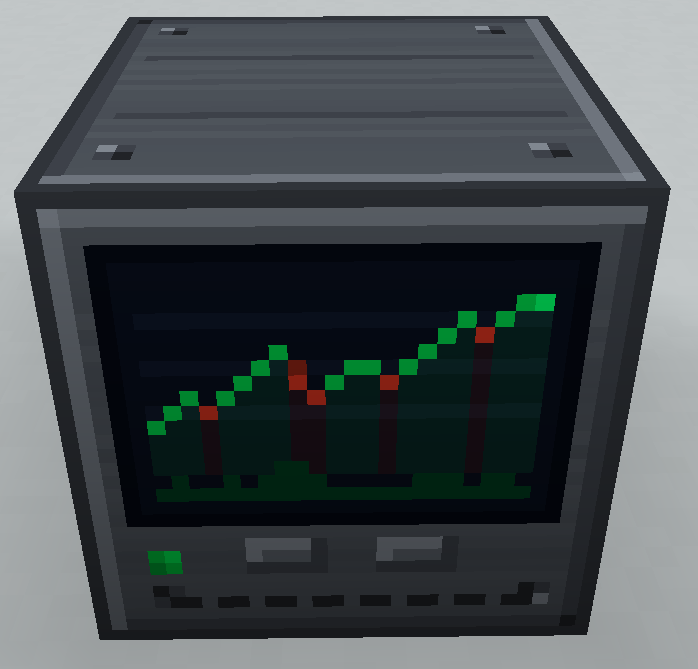
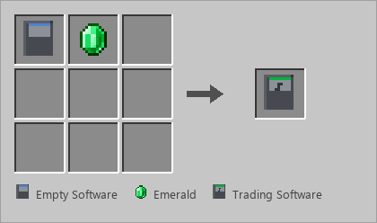
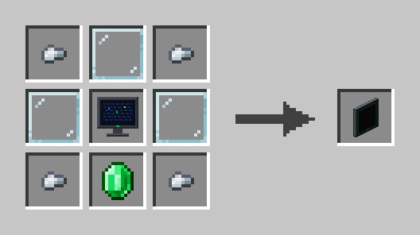
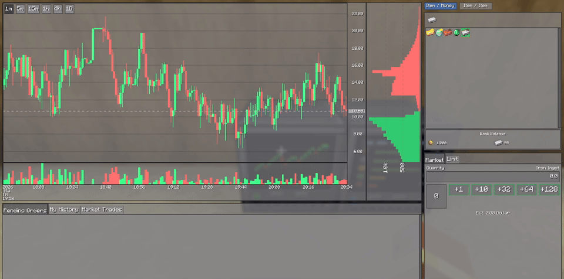
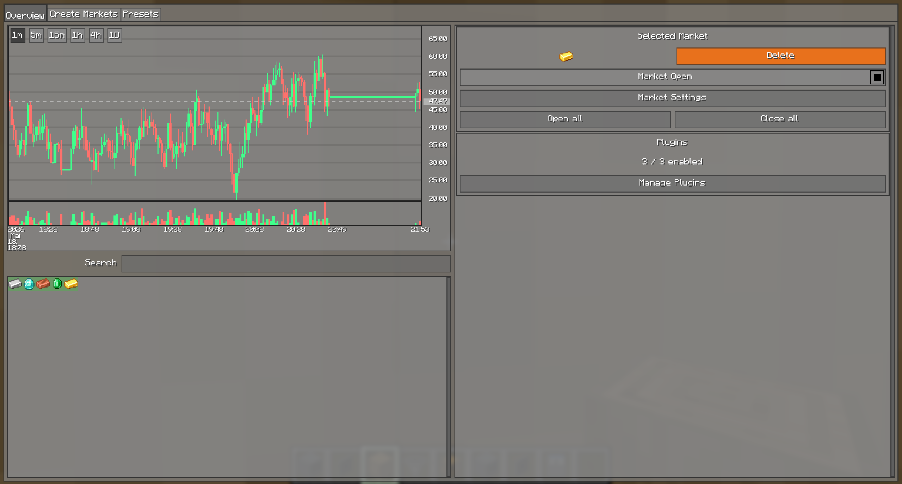
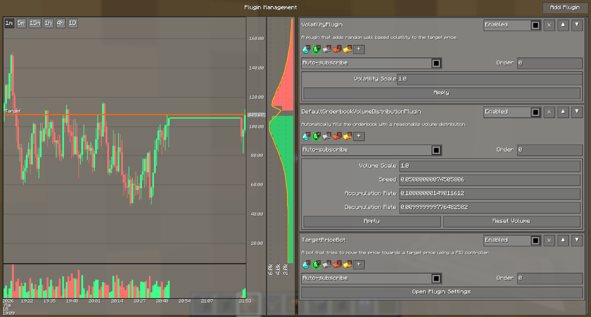
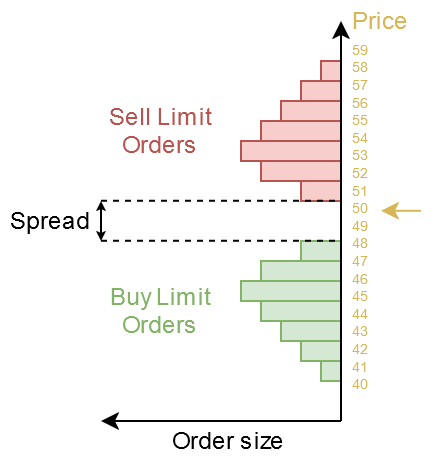
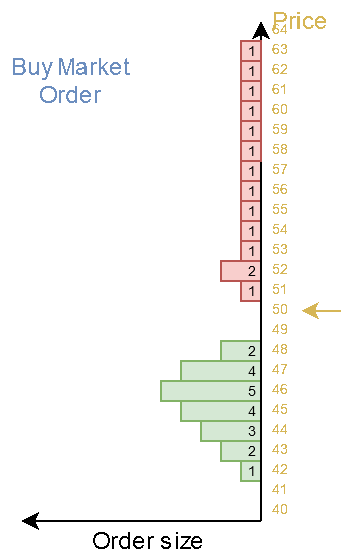
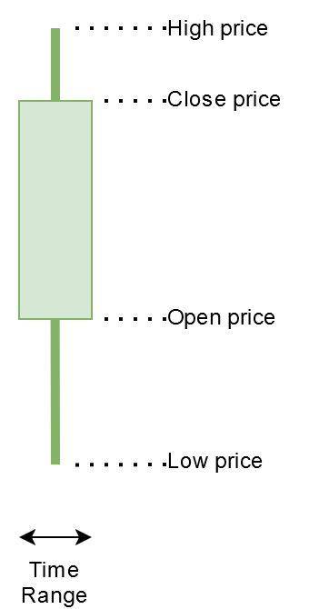
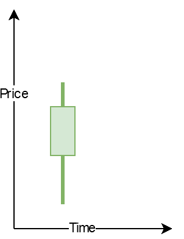

# StockMarket Mod

## About
StockMarket is a Minecraft mod that brings a better way for trading to the game. It enables players to trade items on a virtual stock market, making it ideal for multiplayer servers with active economies. For servers that do not have enough players or even for single player, plugins can be added that simulate a large player base and provide liquidity and price movements to the market.

<tr>
<td>

     

</td>

You want to support me? 

---

## Chapters 
* [Features](#features)
* [Blocks](#blocks)
* [Crafting Recipes](#crafting-recipes)
* [Matching Engine](#matching-engine)
    * [Market Order](#market-order)
    * [Limit Order](#limit-order)
* [How to use](#how-to-use)
    * [For Players](#for-players)
    * [For Admins / Single Player](#for-admins--single-player)
* [Commands](#commands)
* [Plugins](#plugins)
* [Changelog](#changelog)
* [Discord to help me improve the mod](https://discord.gg/qHNVaDGAyB)

---
## Features
- Adds a banking system to the game for money and items.
- Adds new [blocks](#blocks) to interact with the market or bank account.
- Implementation of a [matching engine](#matching-engine) inspired by the real market.
- Configurable [plugins](#plugins) that provide the market with liquidity, volatility and price movements.

## Dependencies
- [Bank System Mod](https://github.com/KROIA/BankSystem)
- [Architectury](https://www.curseforge.com/minecraft/mc-mods/architectury-api)
- [Quilted Fabric API](https://www.curseforge.com/minecraft/mc-mods/qsl) (Only needed for Quilt)
- [Mod Utilities](https://www.curseforge.com/minecraft/mc-mods/modutilities) (Only needed for Quilt)
- [Fabric API](https://www.curseforge.com/minecraft/mc-mods/fabric-api) (Only needed for Fabric)

---
## Downloads
<!--
[CurseForge](https://www.curseforge.com/minecraft/mc-mods/stockmarket)

| Version | Download |
|---------|----------|
|1.3.0    |          |

-->
[CurseForge](https://www.curseforge.com/minecraft/mc-mods/stockmarket)
| Minecraft | Fabric | Forge | Quilt | Neoforge |
|-----------|--------|-------|-------|----------|
|     |  |                                                                                  |                                                                                   | [][2.0.1-neoforge-1.21.1]  |
|     | [][1.3.1-fabric-1.21.1]   |                                                                                  |                                                                                   | [][1.3.1-neoforge-1.21.1]  |
|       | [][1.3.1-fabric-1.21]     |                                                                                  |                                                                                   | [][1.3.1-neoforge-1.21]    |
|     | [][1.3.1-fabric-1.20.6]   |                                                                                  |                                                                                   | [][1.3.1-neoforge-1.20.6]  |
|     | [][1.3.1-fabric-1.20.4]   | [][1.3.1-forge-1.20.4]   | [][1.3.1-quilt-1.20.4]    |                                                                                 |
|     | [][1.3.1-fabric-1.20.2]   | [][1.3.1-forge-1.20.2]   | [][1.3.1-quilt-1.20.2]    |                                                                                 |
|     | [][1.3.1-fabric-1.20.1]   | [][1.3.1-forge-1.20.1]   | [][1.3.1-quilt-1.20.1]    |                                                                                 |
|     | [][1.3.1-fabric-1.19.4]   | [][1.3.1-forge-1.19.4]   |                                                                                |                                                                                 |
|     | [][1.3.1-fabric-1.19.3]   | [][1.3.1-forge-1.19.3]   | [][1.3.1-quilt-1.19.3]    |                                                                                 |
|     | [][1.3.1-fabric-1.19.2]   | [][1.3.1-forge-1.19.2]   | [][1.3.1-quilt-1.19.2]    |                                                                                 |

<!--	Links to curseforge:	-->
[2.0.1-neoforge-1.21.1]:https://www.curseforge.com/minecraft/mc-mods/stockmarket/files/8122945

[1.3.1-fabric-1.21.1]:https://www.curseforge.com/minecraft/mc-mods/stockmarket/download/6200719
[1.3.1-fabric-1.21]:https://www.curseforge.com/minecraft/mc-mods/stockmarket/download/6200713
[1.3.1-fabric-1.20.6]:https://www.curseforge.com/minecraft/mc-mods/stockmarket/download/6200704
[1.3.1-fabric-1.20.4]:https://www.curseforge.com/minecraft/mc-mods/stockmarket/download/6200697
[1.3.1-fabric-1.20.2]:https://www.curseforge.com/minecraft/mc-mods/stockmarket/download/6200673
[1.3.1-fabric-1.20.1]:https://www.curseforge.com/minecraft/mc-mods/stockmarket/download/6200639
[1.3.1-fabric-1.19.4]:https://www.curseforge.com/minecraft/mc-mods/stockmarket/download/6200635
[1.3.1-fabric-1.19.3]:https://www.curseforge.com/minecraft/mc-mods/stockmarket/download/6200628
[1.3.1-fabric-1.19.2]:https://www.curseforge.com/minecraft/mc-mods/stockmarket/download/6200617

[1.3.1-forge-1.20.4]:https://www.curseforge.com/minecraft/mc-mods/stockmarket/download/6200698
[1.3.1-forge-1.20.2]:https://www.curseforge.com/minecraft/mc-mods/stockmarket/download/6200684
[1.3.1-forge-1.20.1]:https://www.curseforge.com/minecraft/mc-mods/stockmarket/download/6200647
[1.3.1-forge-1.19.4]:https://www.curseforge.com/minecraft/mc-mods/stockmarket/download/6200638
[1.3.1-forge-1.19.3]:https://www.curseforge.com/minecraft/mc-mods/stockmarket/download/6200631
[1.3.1-forge-1.19.2]:https://www.curseforge.com/minecraft/mc-mods/stockmarket/download/6200620
					 
[1.3.1-quilt-1.20.4]:https://www.curseforge.com/minecraft/mc-mods/stockmarket/download/6200701
[1.3.1-quilt-1.20.2]:https://www.curseforge.com/minecraft/mc-mods/stockmarket/download/6200692
[1.3.1-quilt-1.20.1]:https://www.curseforge.com/minecraft/mc-mods/stockmarket/download/6200659
[1.3.1-quilt-1.19.3]:https://www.curseforge.com/minecraft/mc-mods/stockmarket/download/6200632
[1.3.1-quilt-1.19.2]:https://www.curseforge.com/minecraft/mc-mods/stockmarket/download/6200622

[1.3.1-neoforge-1.21.1]:https://www.curseforge.com/minecraft/mc-mods/stockmarket/download/6200720
[1.3.1-neoforge-1.21]:https://www.curseforge.com/minecraft/mc-mods/stockmarket/download/6200717
[1.3.1-neoforge-1.20.6]:https://www.curseforge.com/minecraft/mc-mods/stockmarket/download/6200707

---
## Blocks
<table>
<tr>
<td>
<b>Stock Market Block</b> 
Used to get access to the stock market. 
Interaction using right click. 
Right click on a <b>Terminal Block</b> using a <b>Trading Software</b> to create this block.
</td>
<td>

     

</td>
</tr>
</table>

---
## Crafting Recipes

<table>
<tr>
<td><b>Trading Software</b></td>
<td><b>Stock Market Display Block</b></td>
</tr>
<tr>
<td></td>
<td></td>
</tr>
</table>

---
## Matching Engine
##### What is a Matching Engine?
A matching engine is the core component of a trading system that facilitates the buying and selling of items, stocks, or other assets. Its primary function is to match buy orders and sell orders based on specific rules to execute trades efficiently and fairly.

##### Matching Roles
For simplicity are no special roles implemented. The type of order and the price is all what the matching engine needs to match the orders.

---
### Type of Trades
#### Market Order
A market order requires only the **amount** to buy/sell. The trade is executed on the best available price. 

**Benefits**
- The trade is executed immediately

**Disadvantages**
- When buing/selling, the average buy/sell price is mostly higher/lower than the market price before the trade.
- Creates high volatility for markets with low liquidity, see: [Order Book Swipe](#order-book-swipe)
- A market order can only be executed when there are enough volume present on the opposite side to fill the order. Otherwise the order may only be filled partially.

#### Limit Order
A limit order requires an **amount** and **price** at which the trade gets executed. A buy order gets mostly placed below the current market price. The order is executed when the market price moves towards the order price.

**Benefits**
- For a buy order, the price a trader has to pay is at the **price** level or lower.
- For a sell order, the received amount is at least the **price** or higher.
- Limit orders are important for a market because it provides the required liquidity for the market to be able to process market orders.

**Disadvantages**
- The order needs time to be filled by the market.
- When the price never reaches the desired buy/sell price, the order never gets executed and stays pending.

---
## How to use
### For Players

#### Getting Started
To trade items, the item must have an active market. This is managed by the [server admin](#for-admins--single-player). 
Before trading, deposit the items you want to sell into your bank account using the **Bank Terminal Block**. 
See [Bank System Mod](https://github.com/KROIA/BankSystem) to learn how banking works.

#### Opening the Trading Terminal
Right-click on a **Stock Market Terminal Block** to open the trading interface.

    

#### Trading Interface Overview
The trading screen has two main areas:
- **Left side** — A real-time [candlestick chart](#candle-stick-chart) showing price history, with the [order book](#order-book) volume displayed along the right edge of the chart.
- **Right side** — The trading panel with tabs for placing orders, viewing pending orders, order history, and recent market trades.

At the top of the screen is a **favorites bar** for quickly switching between markets. Click any market button, or use the market selector popup to browse all available items.

#### Trading Modes
The terminal supports two trading modes, switchable via toggle buttons:

**Money Mode** — Trade a single item for money. This is the standard mode. 
**Pair Mode** — Trade between two different items directly (e.g. trade iron ingots for diamonds). Select a "have" item and a "want" item using the pair selector.

#### Placing Orders
Select the **Market Order** or **Limit Order** tab in the trading panel:

**Market Order:**
1. Enter the quantity you want to buy or sell (use the quick-add buttons: +1, +10, +32, +64, +128).
2. Click **Buy** or **Sell**. The order executes immediately at the best available price.

**Limit Order:**
1. Enter the quantity and your desired price.
2. Click **Buy** or **Sell**. The order is placed on the order book and waits until the market reaches your price.

In **Pair Mode**, the trading panel switches to show **Market Exchange** and **Limit Exchange** tabs, which work the same way but for cross-market trades at the current exchange rate.

#### Managing Orders
- **Pending Orders** tab shows all your active limit orders. Each order has a cancel button.
- **Drag and drop** — Limit orders appear as markers on the chart. Drag a marker to change the order price. If you don't have enough funds to move a buy order higher, it will stay in place.
- **My History** tab shows your completed and cancelled orders.
- **Market Trades** tab shows the latest trades on the selected market.

Once your buy orders are filled, withdraw the purchased items from your bank account using the **Bank Terminal Block**.

---
### For Admins / Single Player

All market management in v2.0 is done through graphical interfaces. The old command-based bot setup has been replaced by the **Management GUI** and the **Plugin System**.

#### Getting Admin Access
A server operator needs to grant StockMarket admin privileges: 
<code>/stockmarket op</code> — Grant admin to yourself 
<code>/stockmarket op [username]</code> — Grant admin to another player

#### Opening the Management GUI
Run <code>/stockmarket manage</code> to open the management interface. It has three tabs:

    

    

      <b>Overview Tab</b>
    

    The overview shows all existing markets in a searchable grid. 
    - Click a market to select it and view its price chart. 
    - Use the <b>Market Settings</b> button to configure individual market parameters. 
    - Use the <b>Open/Close</b> checkbox to enable or disable trading on a market. Close a market before making major changes to prevent players from exploiting price movements. 
    - Use the <b>Remove</b> button to delete a market. Open positions from players will be automatically closed. 
    - The <b>Manage Plugins</b> button opens the Plugin Management screen (see below). 

    

      <b>Create Markets Tab</b>
    

    Create new markets for items to be traded on the stock market. 
    <b>1)</b> Select an item category from the left panel. 
    <b>2)</b> Browse or search for items in the grid. 
    <b>3)</b> Click items to add them to the selection list on the right. 
    <b>4)</b> Set a starting price and abundance for each selected item. 
    <b>5)</b> Click <b>Create All</b> to create all selected markets at once. 

    

      <b>Presets Tab</b>
    

    Edit the default price and abundance values used when creating new markets. 
    - Browse presets by category. 
    - Adjust price and abundance fields for any item. 
    - Click <b>Save</b> to persist your changes. 

#### Plugin System
Plugins replace the old bot system. They are modular components that can be added to markets to provide liquidity, simulate price movements, and more.

Open the **Plugin Management** screen from the Management GUI overview tab:

    

- **Add plugins** — Click the add button and choose from available plugin types.
- **Configure** — Each plugin has its own settings. Simple plugins show settings inline; complex ones open a dedicated configuration screen.
- **Subscribe to markets** — Plugins can be subscribed to one or more markets. Use the subscribe button to choose which markets a plugin operates on.
- **Enable/Disable** — Toggle plugins on or off without removing them.
- **Reorder** — Move plugins up or down to change their execution priority. Plugins are executed from top to bottom.
- **Auto-subscribe** — Enable to automatically subscribe a plugin to newly created markets.

    
<strong>Tip:</strong> Close a market before changing its plugin settings to prevent players from exploiting price movements during configuration. Re-open it once you are satisfied with the result. When a market gets closed, all pending orders are cancelled.

## Commands
| Command | Description | Admin only |
|---------|-------------|------------|
| /stockmarket manage                | Open the Management GUI to create/remove markets and manage plugins | :heavy_check_mark: |
| /stockmarket op [username]         | Grant StockMarket admin privileges (to yourself if no username given) | :heavy_check_mark: |
| /stockmarket deop [username]       | Revoke StockMarket admin privileges (from yourself if no username given) | :heavy_check_mark: |
| /stockmarket \<market\> remove     | Delete a market without the GUI. `<market>` is the item's registry name in quotes (e.g. `"minecraft:iron_ingot"`) or the numeric market ID shown when a name is ambiguous. Also works for broken markets whose item can no longer be resolved | :heavy_check_mark: |
| /stockmarket preset add \<category\> [name] | Capture the item in your main hand (including data components like enchantments or custom names) as a market preset in `<category>` (created if it doesn't exist yet; quote names containing spaces). The optional `[name]` gives the captured item a custom name; otherwise the preset uses the item's normal display name | :heavy_check_mark: |

## Plugins
Since v2.0, the old monolithic StockMarketBot has been replaced by a modular **plugin system**. Each plugin handles one aspect of market simulation and can be independently configured, enabled, or subscribed to specific markets through the [Plugin Management](#plugin-system) screen.

The mod ships with three built-in plugins:

### VolatilityPlugin
Simulates realistic price movements using a [random walk](#random-walk) algorithm. Each market gets independent price fluctuations around its default price, creating the organic-looking charts you see in-game.

**Settings:**
| Parameter | Description |
|-----------|-------------|
| Volatility Scale | Multiplier for how far the price deviates from the default price. Higher values produce larger swings. |

### TargetPriceBot
The market-making bot that drives prices toward a target value. It places [market orders](#market-order) to push the price in the desired direction. A [PID controller](#pid-controller) determines the size and direction of each order to smoothly converge on the target price without overshooting.

The target price is influenced by the **VolatilityPlugin** (random walk noise) and by player trading activity (supply and demand).

**Settings:**
| Parameter | Description |
|-----------|-------------|
| PID P | Proportional gain — how aggressively the bot reacts to the current price difference. |
| PID I | Integral gain — how much accumulated past error influences the bot's orders. |
| PID D | Derivative gain — how much the rate of price change dampens the bot's response. |
| PID Rate | How quickly the PID controller updates. |

### DefaultOrderbookVolumeDistributionPlugin
Automatically fills the [order book](#order-book) with a realistic volume distribution so that players always have liquidity to trade against. Without this plugin, market orders would have no counterpart to fill against.

The distribution uses a power-law shape near the current price (tighter spreads close to market) with a Gaussian cluster around the default price and a background liquidity level across all price levels.

**Settings:**
| Parameter | Description |
|-----------|-------------|
| Volume Scale | Base volume multiplier, scaled further by each market's natural abundance. |
| Speed | How quickly the order book converges toward the target distribution. |
| Accumulation Rate | How fast volume builds up when below target. |
| Decumulation Rate | How fast excess volume decreases (slower for stability). |
| Reset Volume | Force an immediate reset of the order book to the target distribution. |

### How the plugins work together
The three plugins combine to create a functioning market:
1. The **VolatilityPlugin** generates a wandering target price using random walk noise.
2. The **TargetPriceBot** places market orders to push the actual price toward the target, using a PID controller for smooth convergence.
3. The **DefaultOrderbookVolumeDistributionPlugin** keeps the order book filled with liquidity so that both bot orders and player orders can be executed.

---

## Why does a price move?
If you don't know what a [Order Book](#order-book) is, learn the basics first and come back later. 
A price can move in two ways:
* market order 
* Limit on oposite price
A market order is always executed at the current price. 
Example with a buy market order:
1) A player places a market buy order with a volume of 8.
2) The matching engine will search a sell limit order with the lowest price.
3) The market order gets filled by the sell order. 
4) If the buy order is not filled completly, the matching engine searches again for the best sell order
5) The fill-search process gets repeated until the complete market order is filled.
6) If no more sell orders can be found to fill the buy order, the buy order can not be filled completly. No one is selling, so the remainings of the order will get canceled. To avoid this problem, enough liquidity is needed for the market.

Example with a buy limit order:
1) A player places a limit order with a volume of 8 above the current market price.
2) The matching engine will search a sell limit order with the lowest price to fill the buy order, just like the market order. But the engine will not search for higher limit orders than the limit price of the buy order.
3) If the order was not filled completly, the remaining amount will stay at that position as a normal limit buy order.

As you can see in the pictures below, the current price is always that price, where the matching engine has last processed 2 orders.

---
## Terminology
---
### Order Book
The Order Book is a list with all limit orders waiting to be processed. A buy order is always on a lower or equal price as the current market price and sell orders above or at the same price.
When a buy order is at the same price like a sell order, they will get matched by the matching engine.
The spread is the price difference from the last executed sell to the last executed buy price.
The smaller the spread the better.
Buy/Sell orders which are placed nearer to the current market price will get processed first.

     

---
### Order Book Swipe
A order book swipe can occure when a market does not provide enough liquidity to fill large market orders.
The image above shows that in an example for a large buy order and to less sell limit orders.
Since the matching engine try's to fill the market order, the market price can rise extremly high when the market order is large enough and the sell volume is low enough.
For the player who executed the buy order, this is bad since all sell orders are on different prices, the average buy price can rise much higher than expected.
The same can happen for sell orders, in that case the player will not receive as much money for the selled goods as expected.

     

---
### Candle Stick Chart
The candle stick chart is a common used representation of price history.
Each candle has a fixed time width. Candles are available for different time scales.
The timescale can't be changed in the mod.
A admin can change the time for each candle, default is 1 min.
A cancle can be defined with 4 values:
- **Open Price**
  The current price the market had when the new candle was created.
- **High Price**
  The highest price the market had since the candle was created.
- **Low Price**
  The lowest price the market had since the candle was created. 
- **Close Price**
  The current price the market had when the candle was finished.

     

Below is a short animation to show how a price movement can be visualized using candle sticks.

     

### Random Walk
A random walk is a way to generate pseudorandom values ​​that depend on the previous values.
This value is a great source to create random market prive movements.

### PID-Controller
Since this is a complex field from control theory, I will not cover this here.
[PID Controller Wikipedia](https://en.wikipedia.org/wiki/Proportional%E2%80%93integral%E2%80%93derivative_controller)

     

---

## Changelog

| Version | Status | Highlights |
|---|---|---|
| [v2.0.3](changelog/v2.0.3.md) | In Development | |
| [v2.0.2](changelog/v2.0.2.md) | Released | Crash hotfix and UI locale hardening |
| [v2.0.1](changelog/v2.0.1.md) | Released | Plugin system frontend, inter-market trading, TradingView, preset editor, 30+ features |
| [v2.0.0_ALPHA_1](changelog/v2.0.0_ALPHA_1.md) | Released | Plugin system, management UI, security hardening, 45 bug fixes |
| v1.3.1 | Stable | Multi-version support (MC 1.19.2–1.21.1), bot settings GUI, market management |
| v1.3.0 | Stable | |
| v1.2.x | Legacy | |
| v1.1.x | Legacy | |

