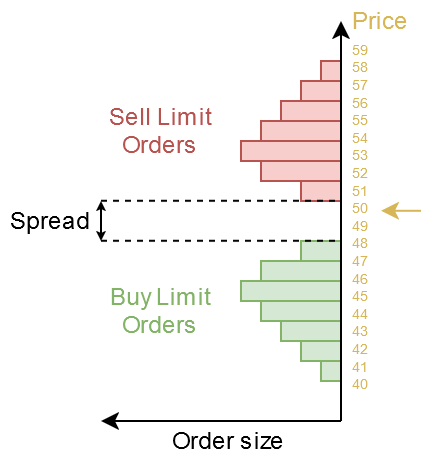

# StockMarket Mod

## About
StockMarket is a Minecraft mod that brings a better way for trading to the game. It enables players to trade items on a virtual stock market, making it ideal for multiplayer servers with active economies. For Server that have not enough players or even for single player, a market bot can be added that simulates a large player base and provides liquidity to the market.
<table>
<tr>
<td>

     

</td>
</table>

---

## Chapters 
* [Features](#features)
* [Blocks](#blocks)
* [Items](#items)
* [Matching Engine](#matching-engine)
    * [market-order](#market-order)
    * [Limit Order](#limit-order)
* [How to use](#how-to-use)
    * [For server player / single player](#for-server-player--single-player)
    * [For admins / single player](#for-admins--single-player)
* [Commands](#commands)
* [Stock Market Bot](#stock-market-bot)

---
## Features
- Adds a banking system to the game for money and items.
- Adds new [blocks](#blocks) to interact with the market or bank account.
- Implementation of a [matching engine](#matching-engine) inspired by the real market.
- Configurable [bot](#stock-market-bot) which provides the market with liquidity and volatility 

---
## Blocks
<table>
<tr>
<td>
<b>Metal Case Block</b> 
Casing for the Terminal block. 
8 Iron ingots
</td>
<td>

     

</td>
</tr>

<tr>
<td>
<b>Terminal Block</b> 
Unprogrammed terminal. 
Can be programmed using a software item. 
4 Iron nuggets 
1 Metal Case Block 
1 Display 
1 Circuit Board 
2 Redstone
</td>
<td>

     

</td>
</tr>

<tr>
<td>
<b>Banking Terminal Block</b> 
Used to get access to the bank account. 
Interaction using right click. 
Right click on a <b>Terminal Block</b> using a <b>Banking Software</b> to create this block.
</td>
<td>

     

</td>
</tr>

<tr>
<td>
<b>Banking Terminal Block</b> 
Used to get access to the stock market. 
Interaction using right click. 
Right click on a <b>Terminal Block</b> using a <b>Trading Software</b> to create this block.
</td>
<td>

     

</td>
</tr>
</table>

---
## Items
<table>
<tr>
<td>
<b>Circuit Board</b> 
Electronics for other Items. 
1 Nether Quartz 
3 Copper Ingots 
3 Paper 
</td>
<td>

     

</td>
</tr>

<tr>
<td>
<b>Display</b> 
Display for the <b>Terminal Block</b> 
6 Glass Planes 
2 Iron Ingots 
1 Ciruit Board
</td>
<td>

     

</td>
</tr>

<tr>
<td>
<b>Empty Software</b> 
Used to create a specific software 
4 Iron nuggets 
2 Ink Sacs 
3 Paper
</td>
<td>

     

</td>
</tr>

<tr>
<td>
<b>Banking Software</b> 
Used to programm the <b>Terminal Block</b> to be a <b>Bank Terminal Block</b> 
1 Empty Software 
1 Gold Ingot 
</td>
<td>

     

</td>
</tr>

<tr>
<td>
<b>Trading Software</b> 
Used to programm the <b>Terminal Block</b> to be a <b>Stock Market Terminal Block</b> 
1 Empty Software 
1 Emerald 
</td>
<td>

     

</td>
</tr>
</table>

---
## Matching Engine
##### What is a Matching Engine?
A matching engine is the core component of a trading system that facilitates the buying and selling of items, stocks, or other assets. Its primary function is to match buy orders and sell orders based on specific rules to execute trades efficiently and fairly.

##### Matching Roles
For simplicity are no special roles implemented. The type of order and the price is all what the matching engine needs to match the orders.

---
### Type of Trades
#### Market Order
A market-order requires only the **amount** to buy/sell. The trade is executed on the best available price. 

**Benefits**
- The trade is executed immediately

**Disadvantages**
- When buing/selling, the average buy/sell price is mostly higher/lower than the market price before the trade.
- Creates high volatility for markets with low liquidity, see: [Order Book Swipe](#order-book-swipe)
- A market-order can only be executed when there are enough volume present on the opposite side to fill the order. Otherwise the order may only be filled partially.

#### Limit Order
A limit order requires an **amount** and **price** at which the trade gets executed. A buy order gets mostly placed below the current market price. The order is executed when the market price moves towards the order price.

**Benefits**
- For a buy order, the price a trader has to pay is at the **price** level or lower.
- For a sell order, the received amount is at least the **price** or higher.
- Limit orders are important for a market because it provides the required liquidity for the market to be able to process market-orders.

**Disadvantages**
- The order needs time to be filled by the market.
- When the price never reaches the desired buy/sell price, the order never gets executed and stays pending.

---
## How to use
### For server player / single player
#### Selling Items
To sell items the item must be available on the market. This is managed by the server admin. 
Assuming the item can be traded on the market, you first have to deposit the item to your bank account. This can be done using the **Bank Terminal Block**. 
Open that block using right click. A window will appear.
Place your item stacks in the blocks inventory and press the button **Send items to market**.
This will transfer the items to your bank account.

     

 

Now open the **Stock Market Terminal Block** using right click.
This opens the trading window.
On the left side you can see the [Candle stick chart](#candle-stick-chart)
On the left edge of the chart is the price axis.
On the right edge of the chart is the [Order Book](#order-book) volume displayed.
On the right side of the window is the interaction panel. There you can select the desired item to be traded. Just click on the button and a list of all tradable items will appear.
Type the amount of items you want to buy/sell.
Decide whether you want to execute a market-order or a limit order.
If you want to create a limt order, you have to type in the desired price.
Click on the **sell** button for market or limit order to execute the trade.
A market-order is executet directly but the limit order will be listed on the left side until it is filled or gets canceled.

     

---
### Buying Items
To buy a item you have to get some money first. You can do that by selling other items or receiving money from other players. A server admin can also provide you money...
Assuming you have money, open the **Stock Market Terminal Block**
Select the item you want to trade by pressing the button on the top right with the Label "Price: XX".
Type the amount you want to buy, type a limit price if you want to execute a limit order.
Clock on the **buy** button.
A market-order gets executed directly but a limit order may take some time until it gets filled by the market.

Once you have received the items, you can go to the **Bank Terminal Block**.
On the left side you can see your items on the bank account.
Type the amount you want to receive back in to the text field and click **Receive items from market**. The items will be transfered to the Bank Terminal Block

     

 

---
### For Admins / Single Player
#### Getting started
When you first join a server/save using this mod, some default markets are getting created by the mod.
Each player receives its bank account with 0 balance. 

 
    
 
      <b>Quickstart</b>
    

    <b>Setting up the market bots</b> 
    The simplest way to setup the bots is by calling the command bellow. 
    This command creats a bot for each market which was added by default from the mod. 
    You may want to change the settings for the bots later. 
    <code>
    /StockMarket createDefaultBots
    </code>

 
    
 
      <b>Create a new market</b>
    

    Replace the <b>[itemID]</b> with the minecraft item ID for which you want to create a market. 
    Check out the website <a href="https://minecraftitemids.com/">https://minecraftitemids.com/</a> to find the item ID you need. 
    <code>
        /StockMarket [itemID] create
    </code> 
    You may need to type the <b>"</b> in order to type a string that contains <b>:</b>. 
    <code>
        /StockMarket "minecraft:copper_ingot" create
    </code>

 
    
 
      <b>Creating a custom bot</b>
    

    To create a bot from scratch make sure the market, for which you want to create the bot, already exists.  
    Type the following command, replace the item ID with your markets item ID. 
    <code>
        /StockMarket "minecraft:copper_ingot" bot create
    </code> 
    The bot gets created but is not active, you have to configure it first. 
    Type the following command to read the settings the bot has by default: 
    <code>
        /StockMarket "minecraft:copper_ingot" bot settings get
    </code> 
    To set a setting you can type the following and use the auto complete to select your desired parameter. 
    (**[parameter]** is a placeholder for your chosen parameter you want to set) 
    <code>
        /StockMarket "minecraft:copper_ingot" bot settings set [parameter]
    </code> 
    If you are not sure about what you have to set to which value, just let the values on default.  
    The only values you have to change because they are unique for each item are the following: 
    - <b>Target Price Range</b> Defines the range the bot will try to move the price around. The value you have to set is the upper bound of the range. The lower bound is automaticly 0. 
    - <b>Target Item Balance</b> Defines the amount of items the bot try's to hold in its bank account. If player buy to many items from a bot, the bot will rise the price. When players sell to many items,  
    the bot will lower the price. When the bot holds exactly the target amount balance, the price will move to the <b>target_price_range_value/2</b>. 
    Lets say you want the bot to hold <b>1000 copper ingots</b> and the price should than be at around 100$, you have to type the following: 
    <code>
    /StockMarket "minecraft:copper_ingot" bot settings set targetItemBalance 1000
    </code> 
    <code>
    /StockMarket "minecraft:copper_ingot" bot settings set targetPriceRange 200
    </code> 
    Before the bot can be enabled, you have to overwrite the item balance of the bot. 
    <code>
    /bank "StockMarketBot" setBalance "minecraft:copper_ingot" 1000
    </code> 
    If you want the bot to start the market at the <b>target_price_range_value/2</b> you must give the bot the same amount of items as you have set the <b>Target Item Balance</b>. 
    If you want to create an artificial demand from the bot at the start, you can give less to the bot. 
    <head>
        <meta charset="UTF-8">
        <meta name="viewport" content="width=device-width, initial-scale=1.0">
        <title>Warning Message</title>
        
    </head>
    <body>
        

            ⚠️
            
Do not set the item balance to 0 since this will break the bot. 
            The bot must always have some items and money, otherwise he can't place orders.

            

                

            

        

    </body>
    You may want to change the money balance of the bot. 
    <code>
        /bank "StockMarketBot" show
    </code> 
    <code>
        /bank "StockMarketBot" setBalance "$" 1000000000
    </code> 

 
    
 
      <b>Change bot settings</b>
    

    🚧
    Work in progress

## Commands
| Command | Description | Admin only |
|---------|-------------|------------|
| /money                           											| Show balance                                  |  |
| /money add [amount]              											| Add money to self                             | :heavy_check_mark: |
| /money add [user] [amount]       											| Add money to another player                   | :heavy_check_mark: |
| /money set [amount]              											| Set money to self                             | :heavy_check_mark: |
| /money set [user] [amount]       											| Set money to another player                   | :heavy_check_mark: |
| /money remove [amount]           											| Remove money from self                        | :heavy_check_mark: |
| /money remove [user] [amount]    											| Remove money from another player              | :heavy_check_mark: |
| /money send [user] [amount]      											| Send money to another player                  |  |
| /money circulation               											| Show money circulation of all players + bot   |  |
| /bank                                                						| Show bank balance (money and items)      		|  |
| /bank [username] show                                						| Show bank balance of another player      		| :heavy_check_mark: |
| /bank [username] create [itemID] [amount]            						| Create a bank for another player         		| :heavy_check_mark: |
| /bank [username] setBalance [itemID] [amount]        						| Set balance of a bank for another player 		| :heavy_check_mark: |
| /bank [username] delete [itemID]                     						| Delete a bank for another player         		| :heavy_check_mark: |
| /StockMarket setPriceCandleTimeInterval [seconds]                         | Set price candle time interval                | :heavy_check_mark: |
| /StockMarket createDefaultBots                                            | Create default bots                           | :heavy_check_mark: |
| /StockMarket order cancelAll                                              | Cancel all orders                             |  |
| /StockMarket order cancelAll [itemID]                                     | Cancel all orders of an item                  |  |
| /StockMarket order [username] cancelAll                                   | Cancel all orders of a player                 | :heavy_check_mark: |
| /StockMarket order [username] cancelAll [itemID]                          | Cancel all orders of a player for an item     | :heavy_check_mark: |
| /StockMarket [itemID] bot settings get                                    | Get bot settings                         		| :heavy_check_mark: |
| /StockMarket [itemID] bot settings set enabled                            | Enable bot                               		| :heavy_check_mark: |
| /StockMarket [itemID] bot settings set disabled                           | Disable bot                              		| :heavy_check_mark: |
| /StockMarket [itemID] bot settings set volatility [volatility]            | Market volatility strength					| :heavy_check_mark: |
| /StockMarket [itemID] bot settings set orderRandomness [orderRandomness]  | Additional random sell/buy orders        		| :heavy_check_mark: |
| /StockMarket [itemID] bot settings set imbalancePriceChangeFactorLinear [factor]  | Linear scale how much a price changes when the item stock moves away from the target item stock.        		| :heavy_check_mark: |
| /StockMarket [itemID] bot settings set imbalancePriceChangeFactorQuadratic [factor]  | Quadratic scale how much a price changes when the item stock moves away from the target item stock. (only active when current balance [ desired balance) | :heavy_check_mark: |
| /StockMarket [itemID] bot settings set imbalancePriceRange [priceRange]   | Set imbalance price range                		| :heavy_check_mark: |
| /StockMarket [itemID] bot settings set targetPriceRange [balance]         | Set the amount the bot trys to hold in its bank | :heavy_check_mark: |
| /StockMarket [itemID] bot settings set maxOrderCount [orderCount]         | Set max order count a bot can create          | :heavy_check_mark: |
| /StockMarket [itemID] bot settings set volumeScale [volumeScale]          | Set volume scale factor to scale the liquidity in the orders | :heavy_check_mark: |
| /StockMarket [itemID] bot settings set volumeSpread [volumeSpread]        | Set the price range the bot places some orders | :heavy_check_mark: |
| /StockMarket [itemID] bot settings set volumeRandomness [volumeRandomness]| Set volume randomness added to each limit order | :heavy_check_mark: |
| /StockMarket [itemID] bot settings set timer [timer]                      | Set the current timer millis, used to do a new random walk step | :heavy_check_mark: |
| /StockMarket [itemID] bot settings set minTimer [timer]                   | Set random min timer value for random walk timer | :heavy_check_mark: |
| /StockMarket [itemID] bot settings set maxTimer [timer]                   | Set random max timer value for random walk timer | :heavy_check_mark: |
| /StockMarket [itemID] bot settings set updateInterval [timeMS]            | Set the bot update interval				    | :heavy_check_mark: |
| /StockMarket [itemID] bot settings set pidP [pidP]                        | Set PID P                                		| :heavy_check_mark: |
| /StockMarket [itemID] bot settings set pidI [pidI]                        | Set PID I                                		| :heavy_check_mark: |
| /StockMarket [itemID] bot settings set pidD [pidD]                        | Set PID D                                		| :heavy_check_mark: |
| /StockMarket [itemID] bot settings set pidIBounds [bounds]                | Set PID I bounds, abs(I) will be [ pidIBounds | :heavy_check_mark: |
| /StockMarket [itemID] bot create                                          | Create bot                               		| :heavy_check_mark: |
| /StockMarket [itemID] bot remove                                          | Remove bot                               		| :heavy_check_mark: |
| /StockMarket [itemID] create                                              | Create marketplace                       		| :heavy_check_mark: |
| /StockMarket [itemID] remove                                              | Remove marketplace                            | :heavy_check_mark: |
| /StockMarket [itemID] currentPrice                                        | Get current price                        		| :heavy_check_mark: |

## Stock Market Bot
The StockMarketBot has multiple purposes. 
- Providing the market with liquidity
- Changing price depending on supply and demand
- Source for capital for players (if they start with 0 money)

#### Providing liquidity
Liquidity is a very important part of every market. 
For example if player A wants to buy wood, someone has to sell the same amount.
Without the counterpart, a trade can't be made.
Since it is unlikely that a server creates enough sell/buy orders to create this
liquidity, the bot is used to provide both buy and sell orders.
The bot will buy if a player wants to sell, and he will sell if a player wants to buy.
The bot can only sell so many items it has and he also can only buy as long as he has money.
The bot always needs some balance of items and money. Without that its function will break.

#### Changing price
The bot is responsible for the most price movements you see on the chart.
The bot is always buying and selling to it self. 
Using a combination of [limit](#limit-order) and [market](#market-order) -orders will create 
movements in price. 
To create a random price chart that also stays in its realistic bounds, multiple stages are needed.
1) **Defining parameters**
    - target stock balance
    - target price range
    - Others...

2) **Defining a target price the market should move to**
    Depending on how many items the bot holds and what its target item balance is,
    it will try to rise or lower the price.
    For example if the bot holds 1000 items, wants to hold 500,
    the bot will lower the target price, making it attractive to players to buy.
    In the case the bot has more items than the target stock balance,
    the target price fall linear and also can reach a price of 0.
    In the case the bot holds less than he wants, the target price will 
    rise quadraticly, producing a even larger price increase.
    The reason for that is, that the bot is dependend on enough supplies to work correct,
    a larger price increase makes it lucrative for players to sell to the bot.

    Additionaly some random noise is used to create the volatility.
    This noise is added to the target price and is generated using a 
    [Random Walk](#random-walk) generator.

3) **Move the market to the target price**
    To change the price the bot creates market- sell/buy -orders. 
    The market oder will fill the previously placed limit orders from the bot or a player.
    [Click here to learn why a price moves](#why-does-a-price-move).
    The size of the market-order defines how fast the price will change.
    A [PID-Controller](#pid-controller) is used to generate the buy/sell market-orders.
    The PID-Controller will make sure to generate the right amount of orders until the 
    target price is reached.

:construction:

---

<table>
<tr>
<td>

     

</td>
<td>

     

</td>
</tr>
</table>

## Why does a price move?
If you don't know what a [Order Book](#order-book) is, learn the basics first and come back later. 
A price can move in two ways:
* market-order 
* Limit on oposite price
A market-order is always executed at the current price. 
Example with a buy market-order:
1) A player places a market buy order with a volume of 8.
2) The matching engine will search a sell limit order with the lowest price.
3) The market-order gets filled by the sell order. 
4) If the buy order is not filled completly, the matching engine searches again for the best sell order
5) The fill-search process gets repeated until the complete market-order is filled.
6) If no more sell orders can be found to fill the buy order, the buy order can not be filled completly. No one is selling, so the remainings of the order will get canceled. To avoid this problem, enough liquidity is needed for the market.

Example with a buy limit order:
1) A player places a limit order with a volume of 8 above the current market price.
2) The matching engine will search a sell limit order with the lowest price to fill the buy order, just like the market-order. But the engine will not search for higher limit orders than the limit price of the buy order.
3) If the order was not filled completly, the remaining amount will stay at that position as a normal limit buy order.

As you can see in the pictures below, the current price is always that price, where the matching engine has last processed 2 orders.
<table>
<tr>
<td>

     

</td>
<td>

     

</td>
</tr>
</table>

---
## Terminology
---
### Order Book
The Order Book is a list with all limit orders waiting to be processed. A buy order is always on a lower or equal price as the current market price and sell orders above or at the same price.
When a buy order is at the same price like a sell order, they will get matched by the matching engine.
The spread is the price difference from the last executed sell to the last executed buy price.
The smaller the spread the better.
Buy/Sell orders which are placed nearer to the current market price will get processed first.

     

---
### Order Book Swipe
A order book swipe can occure when a market does not provide enough liquidity to fill large market-orders.
The image above shows that in an example for a large buy order and to less sell limit orders.
Since the matching engine try's to fill the market-order, the market price can rise extremly high when the market-order is large enough and the sell volume is low enough.
For the player who executed the buy order, this is bad since all sell orders are on different prices, the average buy price can rise much higher than expected.
The same can happen for sell orders, in that case the player will not receive as much money for the selled goods as expected.

     

---
### Candle Stick Chart
The candle stick chart is a common used representation of price history.
Each candle has a fixed time width. Candles are available for different time scales.
The timescale can't be changed in the mod.
A admin can change the time for each candle, default is 1 min.
A cancle can be defined with 4 values:
- **Open Price**
  The current price the market had when the new candle was created.
- **High Price**
  The highest price the market had since the candle was created.
- **Low Price**
  The lowest price the market had since the candle was created. 
- **Close Price**
  The current price the market had when the candle was finished.

     

Below is a short animation to show how a price movement can be visualized using candle sticks.

     

### Random Walk
A random walk is a way to generate pseudorandom values ​​that depend on the previous values.
This value is a great source to create random market prive movements.

### PID-Controller
Since this is a complex field from control theory, I will not cover this here.
[PID Controller Wikipedia](https://en.wikipedia.org/wiki/Proportional%E2%80%93integral%E2%80%93derivative_controller)

     

