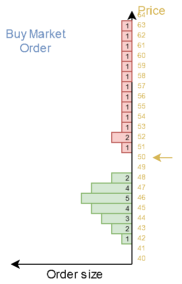
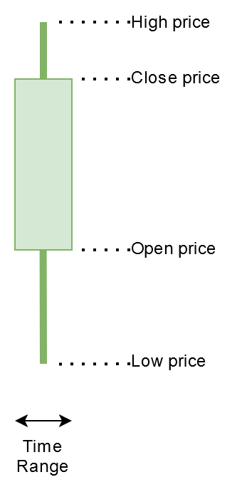

# How the Market works

## Why does a price move?
If you don't know what a [Order Book](#order-book) is, learn the basics first and come back later. 
A price can move in two ways:
* market-order 
* Limit on oposite price
A market-order is always executed at the current price. 
Example with a buy market-order:
1) A player places a market buy order with a volume of 8.
2) The matching engine will search a sell limit order with the lowest price.
3) The market-order gets filled by the sell order. 
4) If the buy order is not filled completly, the matching engine searches again for the best sell order
5) The fill-search process gets repeated until the complete market-order is filled.
6) If no more sell orders can be found to fill the buy order, the buy order can not be filled completly. No one is selling, so the remainings of the order will get canceled. To avoid this problem, enough liquidity is needed for the market.

Example with a buy limit order:
1) A player places a limit order with a volume of 8 above the current market price.
2) The matching engine will search a sell limit order with the lowest price to fill the buy order, just like the market-order. But the engine will not search for higher limit orders than the limit price of the buy order.
3) If the order was not filled completly, the remaining amount will stay at that position as a normal limit buy order.

As you can see in the pictures below, the current price is always that price, where the matching engine has last processed 2 orders.

---
## Terminology
### Order Book
The Order Book is a list with all limit orders waiting to be processed. A buy order is always on a lower or equal price as the current market price and sell orders above or at the same price.
When a buy order is at the same price like a sell order, they will get matched by the matching engine.
The spread is the price difference from the last executed sell to the last executed buy price.
The smaller the spread the better.
Buy/Sell orders which are placed nearer to the current market price will get processed first.

     

---
### Order Book Swipe
A order book swipe can occure when a market does not provide enough liquidity to fill large market-orders.
The image above shows that in an example for a large buy order and to less sell limit orders.
Since the matching engine try's to fill the market-order, the market price can rise extremly high when the market-order is large enough and the sell volume is low enough.
For the player who executed the buy order, this is bad since all sell orders are on different prices, the average buy price can rise much higher than expected.
The same can happen for sell orders, in that case the player will not receive as much money for the selled goods as expected.

     

---
### Candle Stick Chart
The candle stick chart is a common used representation of price history.
Each candle has a fixed time width. Candles are available for different time scales.
The timescale can't be changed in the mod.
A admin can change the time for each candle, default is 1 min.
A cancle can be defined with 4 values:
- **Open Price**
  The current price the market had when the new candle was created.
- **High Price**
  The highest price the market had since the candle was created.
- **Low Price**
  The lowest price the market had since the candle was created. 
- **Close Price**
  The current price the market had when the candle was finished.

     

Below is a short animation to show how a price movement can be visualized using candle sticks.

     

