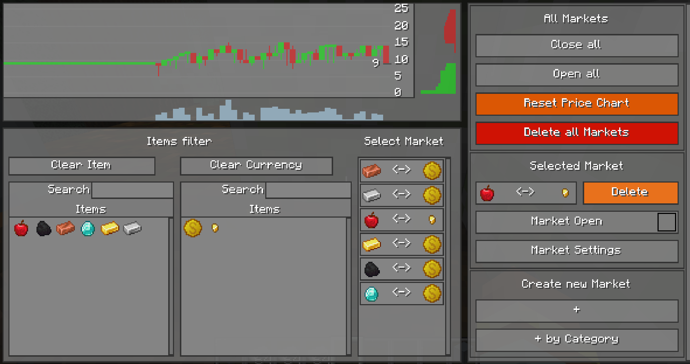

## Manage Markets

<tr>
<td>

     
    <figcaption><b>StockMarket ManagementGUI</b></figcaption>

</td>

---
## Content
- [Change Market Settings](#change-market-settings)
  - [General Settings](#general-settings)
  - [Virtual Order Book Settings](VirtualOrderBook.md)
  - [Bot Settings](MarketBot.md)
- [Troubleshoot](#troubleshoot)
  - [Market is jumping up and down](#market-is-jumping-up-and-down)
  - [Players are going crazy](#players-are-going-crazy)
    - [Players flush the market with items or buy everything off](#players-flush-the-market-with-items-or-buy-everything-off)

---
## Change Market Settings
Select a market and then click the `Market Settings` button.
This opens the `MarketSettings` Screen. 

<tr>
<td>

     
    <figcaption><b>StockMarket MarketSettings Screen</b></figcaption>

</td>

On the left side is the price chart but with some additional information that normal players don't have. 
It visualizes the bots target price which it calculates in the background and places orders accordingly to reach the 
calculated target price.  

### General Settings
- **Reset Price chart**: Will reset the historical data for the market. (Candlestick chart)
- **Market Open**: If checked, the market is open for players to trade. 

> [!WARNING]  
> Close the market before you change settings, to prevent players from exploiting huge price movements that may
> occure because of the changed settings.
> 

- **Candle time**: Defines the time in minutes for each candle in the candlestick chart.

---
### Virtual Order Book Settings
[click here](VirtualOrderBook.md)

---
### Bot Settings
[click here](MarketBot.md)

---
### Troubleshoot
### Market is jumping up and down
If you see that the price jumps up and down within seconds but the displayed `Bot Target Price` does not jump, then you need to change some settings.
Try one or multiple of the following steps:
1) Lower the `Volume scale` in the `Bot Settings` section. Large price jumps are a result of large market orders, created by the bot. Lower the value. For example, divide the value by `10` and press `Save` and wait a view minutes to let the bot settle in.
2) Increase the `Volume` in the `Virtual Order Book Settings` section. By increasing this value, the large bot orders do not have as much of a impact in the price movemenent. 

### Players are going crazy
There are many scenarios that can happen and each scenario is different, depending on the trading pairs it is happening on. Some markets are more robust against the influence of players and some are more likely influenced. 

> [!NOTE]  
> In general, if a market does not have much liquidity, it is more easy for players to manipulate the price.
> 

### Players flush the market with items or buy everything off
When large quantities of items are sold or bought, a imbalance is created. The market tracks how many items player buy/sell to the virtual liquidity. The Virtual Order Book always provides buy and sell opportunities, this creates a problem. For example when many players sell dirt to the market, it will create a large imbalance. Dirt is easy to get and one can sell huge quantities, earning much money. In that case it is important that the bot no longer try's to keep the price on its default price. 
The setting `Volume Tracking` in the `Bot Settings` section is the solution to this problem.
When

