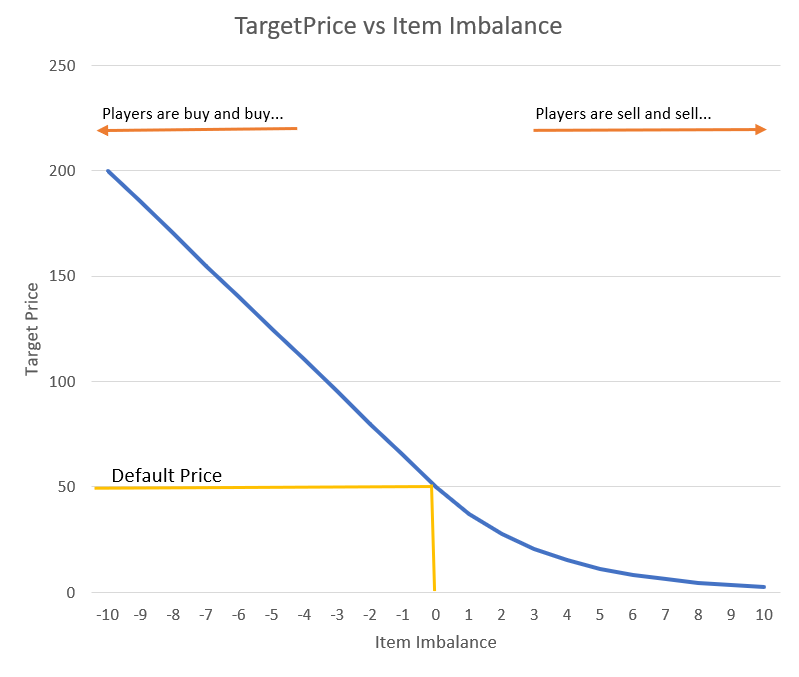
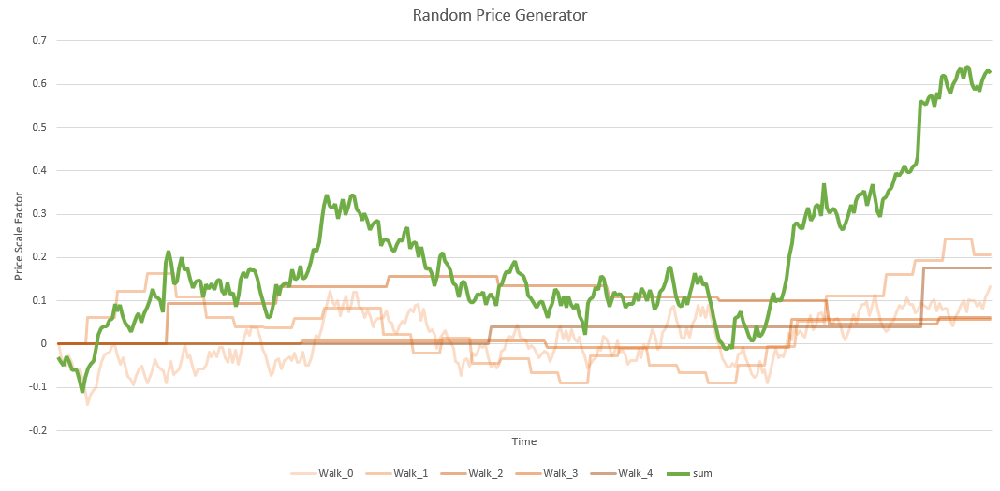

# Bot
This mod would be boring if the price chart would be static and only change if players buy or sell items, because of that the bot exists. It follows specific rules and creats buy and sell orders in order to create a price movement.
It also helps to regulate a market. 

## Features
- Can move the market price to a specified `Default price`.
- Can track the net inflow/outflow of an asset and ajust its price accordingly. 
- Can create a pseudorandom price pattern.

## Settings

<tr>
<td>
<div align="center">
     
    <figcaption><b>StockMarket MarketSettings Screen</b></figcaption>
</div>
</td>

- **Enabled**: Enables/Disables the bot.
 
---
- **Default price**: The price of the asset that the bot shound stay at if nothing special happens.
  This is a very important value and it is the admins responsibility to find a value that fits its server economy.
  For example it does not matter if 1 diamond costs 200 dollar or 2000 dollar.
  But it is important that the ratios from asset to asset match well.
  Lets say 1 diamond costs 200 dollar. how much iron ingots does this represent? 10 Iron? 100 Iron? I don't know.
  Depending on how much iron and diamonds spawn in the world, this can change.
  When 100 iron are a fair price for 1 diamond and 1 diamond costs 200 dollar, then the price for 1 iron must be set to 2 dollar each. When 1 diamond costs 2000 dollar, then the price for 1 iron must be set to 20 dollar.
  - 1 diamond = 200 dollar ---> 1 iron = 2 dollar
  - 1 diamond = 2000 dollar ---> 1 iron = 20 dollar
  
  Makes no difference but it somehow defines the worth of the currency.
  Important is to find a realistic ratio for diamonds to iron or any other item on the stock market and define a price based on one item and then calculate all default prices from that start item and the ratios to the other items.

  For example we want to define the price for the following items:

    | Item	| 
    |------| 
    | Iron |
    | Diamond | 
    | Gold |
    | Copper |
    | Coal |

    We now take the cheapes one, lets take coal.
    We define that `1 Coal is worth 10 Dollar`. Thats just a definition, can be any other value.
    Now we need to estimate how much coal would be a fair deal to be traded for the other items.
    - Lets say it would be fair to trade `10 Coal for 1 Iron`.
    - Lets say for `5 Coal you can get 1 Copper`.
    - The world generator on the map is ajusted so that it does spawn far more Gold than Iron, (just an example) that means that gold has a lower worth than by default. For `2 Coal you get 1 Gold`.
    - Diamonds on the other hand are rare in general and comparing them to Coal is more difficult than to Iron, because of that we say that `100 Iron for 1 Diamond` is a fair deal.
  
    Using this data we can create the following price table:

    | Item	| Default price |
    |------|----|
    | Diamond | 1000   |
    | Iron | 100  |
    | Copper | 50  |
    | Gold | 20  |
    | Coal |  10 |

    The column for the default price can now be scaled by any value it does not change the relative worth from item to item, thats the important thing.
    For example if there is a new item that needs to be traded like dirt, you could define the dirt price at 1 dollar but it does not have any room for the price to go lower than that. 
    Because of that its better to chose a larger base price. Factor all prices by 10 and we get the following price table:

    | Item	| Default price |
    |------|----|
    | Diamond | 10000   |
    | Iron | 1000  |
    | Copper | 500  |
    | Gold | 200  |
    | Coal |  100 |
    | Dirt | 10 |

    Now the Dirt fits in our market well, is very cheap but the ratios of the other items do not change.

    > [!WARNING]  
    > Do not do such a thing as scaling all prices by a factor, after the economy on the server is already established,
    > because by doing so, you change the inflation of the currency and therefore lower the purchasing power of all players which makes them not very happy. Define the prices in the beginning of the economy.
    > This also lets player gain a feeling for the currency, how much worth the used currency is in terms of purchasing power.

---
- **Update interval**: Update interval in milli seconds for the bot. The bot creates one order on every update.
  For a slow market with a higher candle stick time interval, this interval value also can be set to a higher value.
  If you want that much movement can be seen on the chart, this value must be lowered. 
  A lower value may have impact on the server performance, especially if there are many markets at such a low interval.

---
- **Volume scale**: Scale factor for the placed market orders of the bot.
  When the volatility setting is high but you see no changes on the chart for a long time, than you can increase the volume. Its likely that the market has so much volume that the volume of the bot is not enough to move the price.


---
- **Target Price**: When this checkbox is set, the bot will place orders in such a way that the price moves to its
   calculated target price which is visualized with the blue line.
   
- **Steering Factor**: Defines how hard the bot tries to reach its target price. Higher values result in a faster price correction when the bot's target price jumps to a new value.

---
- **Volume Tracking**: This feature solves a problem that can occure when large quantities of an asses are bought or soled over a long time.
  
> [!WARNING] 
> This feature only works if the **Target Price** feature is enabled


  Let's take this scenario:
  A player wants to make money and sees that Dirt is sold for 10 dollar each. Easy money he things and starts to dig with his Efficiency V shovel... He sells dirt in large quantities and since the market for dirt is very liquide because it is a common item, the large sell orders have not much impact in the price.
  Since the bot has the influence on the price and it try's to hold the default price of 10 dollar per dirt, this would be a easy money machine.
  The solution is to track the sold and bought items on the market. If a player sells 10 dirt, a counter gets increased by 10 and if a player buys 10 dirt, it gets decreased by 10.
  If this value stays around 0, the bot trys to move the price to the `Default price`. 

<tr>
<td>
<div align="center">
     
    <figcaption><b>StockMarket MarketSettings Screen</b></figcaption>
</div>
</td>
This chart shows what the bot does with the item imbalance.

- When the imbalance gets negative, meaning that players are constantly buy items, the bot moves the price higher linear.
This will people stop from buying items since it gets more expensive and on the other hand motivate to sell items back to the market. Only then the price will go down again.
- On the other hand when players are constantly selling items, the bot will move its target price lower, converging to 0 to make it less attractive for sellers but more attractive for buyers.

``` Java
if(enableVolumeTracking)
{
    float x = currentItemBalance * volumeSteeringFactor;
    float scale;
    if(currentItemBalance < 0)
    {
       scale = -x + 1;
    }
    else
    {
        scale = Math.exp(-x);
    }
    targetPrice = Math.max(defaultPrice * scale, 0);
}
```
- **Steering Factor**: The Steering Factor for the Volume Tracking scales the item imbalance value, using a large factor, the price will start to move, because of the item imbalance, faster. A lower value needs more items to be sold/bought in order to start having an impact in this algorithm. 


---
- **Random Walk**: When enabled, the bot creates a random looking chart pattern by changing the markets target price around its default price.

> [!WARNING] 
> This feature only works if the **Target Price** feature is enabled


<tr>
<td>
<div align="center">
     
    <figcaption><b>StockMarket MarketSettings Screen</b></figcaption>
</div>
</td>

To simulate a realistic looking price chart, 5 random walk generators are added together.
Each random walk is updated in a different time interval to create high, medium and low frequency changing values.
Added together results in a more or less realistic price chart.
That value is used to calculate a price offset around the current target price.

``` Java
if(settings.enableRandomWalk)
{
    // Update the price generator once every 100 - 1000ms
    if(randomWalkTimer.check())
    {
        randomWalkTimer.start(100+random.nextInt(900));
        priceGenerator.getNextValue();
    }

    double randomWalkValue = priceGenerator.getCurrentValue() * volatility * defaultPrice;
    targetPrice += randomWalkValue;
}
```

- **Volatility**: This value is used to scale the generated random walk price in the example above.
  A larger value will result in a volatile market and values close at zero will result i a more stable market.
