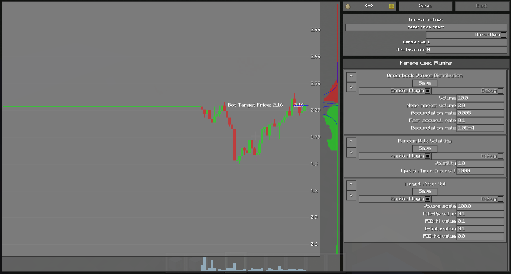

# Manage Plugins


## Overview

<figure align="center">
    
    <figcaption>Market Settings Overview Page</figcaption>
</figure>

Each market can have a list of plugins. The plugins can be managed in the Market Settings Page on the right side.
There is a list of all plugins attached to the market.
Each plugin contains its own settings interface to change settings of the plugin.

Which plugins are attached to a marked can be set in the Plugin Browser by clicking the button **Manage used Plugins**.


---
#### Enable Plugin
This checkbox enables/disables the plugin for this market.
If the plugin is disabled, its update loop will not be executed.

---
#### Debug
This checkbox can be used to enable/disable console outputs for this plugin.
Inside the plugin code, the following methodes can be used to print to the console with this activation/deactivation functionality.

``` Java

public class ExamplePlugin extends MarketPlugin {

    @Override
    protected void update() {
        info("Text");
        error("error");
        warn("warning");
        debug("debug");
    }
}
```
---

#### Plugin Order
In specific cases it may be needed to put the plugins in a custom execution order.
The plugins are executed from top to bottom in this list. 
On the left side of each plugin are two buttons to arrange the plugins inside the list.