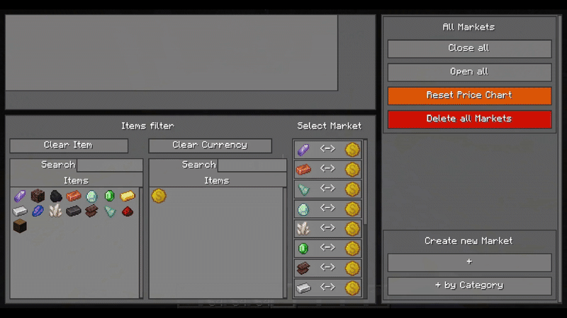
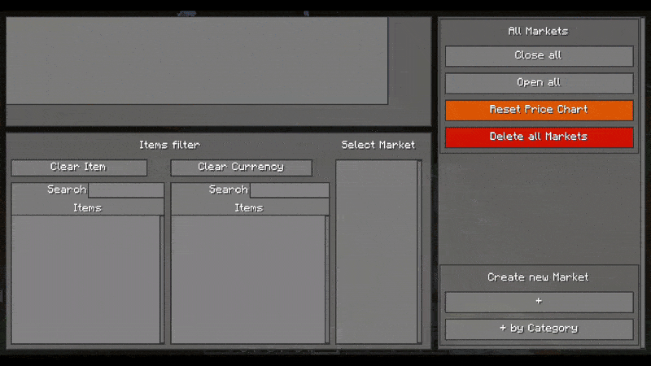

## Setup Markets
No markets are setup in the beginning. They have to be setup by an admin.
There are two ways to create a market.
1) [Create a market by custom selecting two items that are traded against each other.](#custom-market)
2) [Create a market from the presets, provided by the mod](#use-presets-to-create-a-market)

---
### Custom Market
You want to create a market that trades two specific items against each other, this chapter is for you. 
In the [ManagementGUI](AdminSection.md/#managementgui), click on the `+` Button.

<tr>
<td>

     
    <figcaption><b></b></figcaption>

</td>

Select a Item you want to use for trading on the left side and a currency item that is used as payment for the, on the left side, selected item. 
After selecting 2 items, a new panel appears on the right side. Hover over the settings fields to get a helpful tooltip.
Change the settings as you like. 

> [!WARNING]  
> Since the market can do any move in the beginning until balanced settings are found, i recommend to let the market 
> closed in the beginning in order to prevent players from exploiting the not stable market.
> 

Click on the `Create Market` button to create the market.
Visit the [Manage Markets](ManageMarkets.md) chapter to tune the markets settings.

---
### Use Presets to create a Market
If you want to quickly setup some item-money pairs that have preset settings, this chapter is for you. 
In the [ManagementGUI](AdminSection.md/#managementgui), click on the `+ by Category` Button.

<tr>
<td>

     
    <figcaption><b>StockMarket MarketCreationByCategory Screen</b></figcaption>

</td>

In this screen are three columns.
1) **Categories**: In this column are all categories listet that have been loaded from the filesystem. 
   Click on one of them.
2) **Markets in the category**: All markets that are in a category are displayed here.
   You can click on the `+` button on a specific pair to add it to the `Selected Markets` list.
3) **Selected Markets**: In this list are all pairs that got selected. 
   By clicking the `Create selected markets` button, all these selected markets will be created.

> :link: More infos about the presets can be found [here](MarketPresets.md).  
> :link: Visit the [Manage Markets](#manage-markets) chapter to tune the markets settings.
