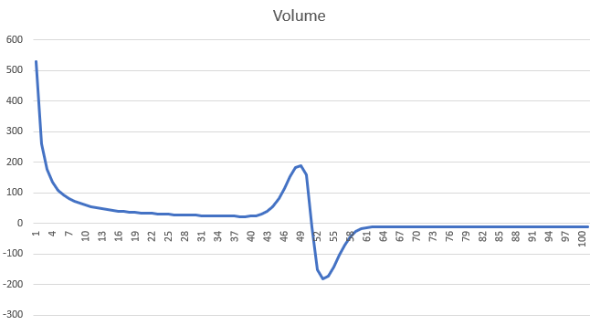

# Virtual Order Book
In order to understand what the virtual order book is, some basic knowladge about an order book in general is needed.
An order book is a list of all the buy and sell orders for a specific asset, like a stock or cryptocurrency.

- Buy orders (also called bids) show how much someone wants to buy and the price they’re willing to pay.
- Sell orders (also called asks) show how much someone wants to sell and the price they want to receive.

The order book helps match buyers with sellers. The highest buy price and the lowest sell price are especially important — these are used to determine the current market price.

---
**Example:**

| Buy Orders (Bids)	| Sell Orders (Asks) |
|------| -----|
| 5 units @ $98 | 3 units @ $101 |
| 8 units @ $97	| 4 units @ $102 |

This means:
- Someone wants to buy 5 units for $98.
- Someone wants to sell 3 units for $101.
- No deal happens until someone agrees on the same price.

In short, the order book shows the current interest in buying and selling, and helps the market find fair prices.

---

Since this is a game and there will never be enough real players participating on the market, the virtual order book simulates the buy and sell orders as they would appear in the real world. 
To do so, a specific volume distribution is created which is displayed in the image below.

<tr>
<td>

     
    <figcaption><b>Virtual Order Book Volume Distribution</b></figcaption>

</td>

The Y-Axis represents the order volume. Positive values mean buy orders and negative values represent sell orders.
The X-Axis represents the price of the asset. The current market price in this image is at 50.
When the price moves down to zero, the buy volume increases and close around the current market price the volume is also higher because thats the region where orders are more likely to be matched.
No one would place an order at a price where the market never reaches. 

---
## Settings
<tr>
<td>

     
    <figcaption><b>StockMarket MarketSettings Screen</b></figcaption>

</td>

- **Enabled**: Enables/Disables the virtual order book.
  In most cases it's better to enable the virtual order book because it provides liquidity to a market.
  When it is disabled, players may not be able to buy/sell items unless there is an oponant that sells/buys.
  In a market where the amount of traded items is strictly limited, like a `share` item or something like that, it makes sense to disable this feature because when the virtual order book is enabled, items can be generated out of nothing, since it simulates a world wide market which provides always liquidity.
  In case of resources like, ores, wood, food and so on, it is strongly recommended to enable the virtual order book.

> [!WARNING]  
> When the virtual order book is disabled, the bot will not work as intended and should be turned off.
> The bot creates market orders which can be exploited by players who know that. 
> For example, The default price of iron is, lets say: `10` dollars, the virtual order book is disabled but the bot is enabled.
> A player now can create a [sell limit order](Order.md/#buysell-limit-order) at a price of `1000` dollars.
> If no other sell order is between the current market price of `10` and `1000` and the bot creates a [buy market order](Order.md/#buysell-market-order), the price will jump to `1000` and the player who placed the sell order will gain huge profits.

- **Volume**: Defines a scale factor for the whole volume distribution. A higher value will simulate a market with a large liquidity where players would need to buy/sell huge quantities to have an impact in the parkets price.
  
- **Near market volume**: Scale factor for the volume distribution, close around the current market price.

- **Accumulaton rate**: Scale factor for how fast the volume accumulates to reach its target volume distribution after some volume was consumed by orders.
  For example if a player creates a large buy order, it consumes a part of the order book. After that, orders are beeing placed again until the volume is refilled. This value defines how fast the volume grows back.

- **Fast accumulatiion rate**: This factor does the same as the **Accumulaton rate** but it gets used when the gap between the current volume, at a specific price is more than 50% off its target volume. 

- **Decummulation rate**: The factor for how fast a already existing volume will decrease if the price moves away and the target volume, according to the distribution formula, would be lower than the current volume.
  A smal walue will create regions of support and resistance which makes it somehow more realistic. 