# News Events Review Catalog

> Auto-generated catalog — do not hand-edit; regenerated from the default news events.

**72 events total** · 72 with a picture · 0 picture pending. Generated 2026-07-19.

## Original events

### Diamond rush in the northern mountains!

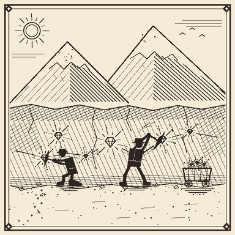

`diamond_rush` · commodities · weight 10 · cooldown 2h · picture: `diamond_rush.png`

**Impact:** trend, peak -35%, ramp 600s / hold 3000s / reversal exponential 4500s (noise ±5%)

- announce delay: front-run window (0s–1m)

**Markets:**

| Item | weightFactor | Direction |
|---|---|---|
| `minecraft:diamond` | 1.0 | ▼ |
| `minecraft:diamond_block` | 1.0 | ▼ |
| `#c:ores` | 0.3 | ▼ |
| `minecraft:emerald` | -0.4 | ▲ |

**EN:** Prospectors report huge diamond veins in the northern mountains. Experts expect supply to surge within days, putting pressure on prices across the ore market. Emerald traders are already rerouting caravans towards the new claims.

Deutsch

**Diamantenrausch in den nördlichen Bergen!**

Schürfer melden riesige Diamantvorkommen in den nördlichen Bergen. Experten erwarten, dass das Angebot innerhalb weniger Tage stark steigt und die Preise am Erzmarkt unter Druck geraten. Smaragdhändler leiten ihre Karawanen bereits zu den neuen Claims um.

---

### Mine collapse halts iron production!

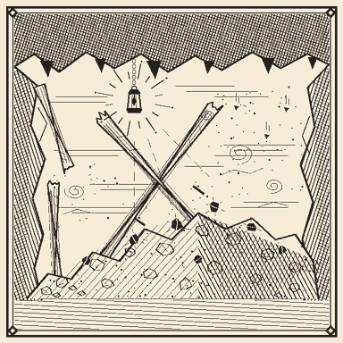

`iron_supply_disruption` · commodities · weight 12 · cooldown 1h30m · picture: `iron_supply_disruption.png`

**Impact:** shock, peak +45%, hold 1200s / reversal 2100s

**Markets:**

| Item | weightFactor | Direction |
|---|---|---|
| `minecraft:iron_ingot` | 1.0 | ▲ |
| `minecraft:iron_block` | 1.0 | ▲ |
| `minecraft:raw_iron` | 0.8 | ▲ |

**EN:** A major mine collapse has cut off several iron shafts. Smelteries warn of delivery delays and traders are stockpiling ingots while repairs are underway.

Deutsch

**Minenunglück stoppt die Eisenproduktion!**

Ein schwerer Mineneinsturz hat mehrere Eisenschächte abgeschnitten. Hütten warnen vor Lieferverzögerungen und Händler horten Barren, während die Reparaturen laufen.

---

### Ore bubble bursts - mining stocks in free fall!

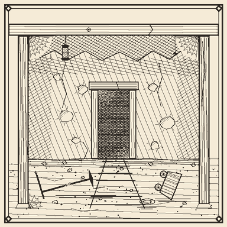

`ore_market_crash` · markets · weight 4 · cooldown 6h · picture: `ore_market_crash.png`

**Impact:** crash, peak -50%, hold 900s / reversal exponential 6000s

**Markets:**

| Item | weightFactor | Direction |
|---|---|---|
| `minecraft:*_ore` | 1.0 | ▼ |
| `minecraft:raw_*` | 0.7 | ▼ |

**EN:** After months of speculation the ore bubble has finally burst. Panic selling grips every ore market as overleveraged traders liquidate their positions. Analysts expect a slow recovery.

Deutsch

**Erzblase geplatzt - Bergbauwerte im freien Fall!**

Nach Monaten der Spekulation ist die Erzblase endlich geplatzt. Panikverkäufe erfassen alle Erzmärkte, während überhebelte Händler ihre Positionen auflösen. Analysten erwarten eine langsame Erholung.

---

### Trade council adopts the gold standard!

`gold_reserve_standard` · politics · weight 2 · cooldown 24h · picture: `gold_reserve_standard.png`

**Impact:** trend, peak +25%, ramp 1500s / hold 3000s / reversal none (permanent)

- fires at most once (notFired itself)
- records `era`=`gold_standard`
- chains → `gold_rush_rumor` (on `hold` step, 50% chance, delay 5m–15m)

**Markets:**

| Item | weightFactor | Direction |
|---|---|---|
| `minecraft:gold_ingot` | 1.0 | ▲ |

**EN:** The trade council has voted to back all inter-village trade with gold reserves. Demand for gold is expected to remain permanently elevated - a structural shift, not a passing rally.

Deutsch

**Handelsrat führt den Goldstandard ein!**

Der Handelsrat hat beschlossen, den gesamten Handel zwischen den Dörfern mit Goldreserven zu decken. Die Goldnachfrage dürfte dauerhaft erhöht bleiben - ein struktureller Wandel, keine kurzfristige Rally.

---

### Rumors of a massive gold strike sweep the trading floor!

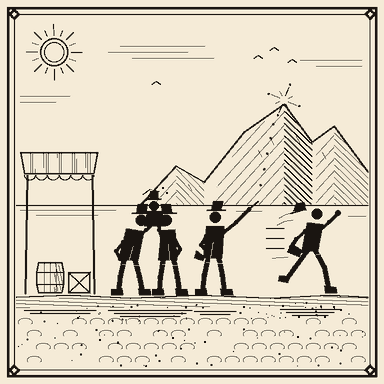

`gold_rush_rumor` · rumors · weight 6 · cooldown 3h · picture: `gold_rush_rumor.png`

**Sequences:**

- **pump_and_dump** (pick weight 2): hype → +40% linear (450–1200s) ±5% · peak → hold (300–600s) ±8% · sell_off → -15% exponential (100–300s) ±4% [step markets: minecraft:gold_ingot×1.0, minecraft:raw_gold×0.6] · recover → 0% linear (1500s)
- **fizzle** (pick weight 1): stir → +15% linear (300–600s) ±4% · denial → 0% exponential (300–900s)

**Markets:**

| Item | weightFactor | Direction |
|---|---|---|
| `minecraft:gold_ingot` | 1.0 | ▲ |

**EN:** Whispers of an enormous gold vein have traders piling into gold. Nobody has actually seen the nugget yet - seasoned brokers warn that rumors like this often collapse as fast as they spread, punishing whoever buys the top.

Deutsch

**Gerüchte über riesigen Goldfund fegen über das Parkett!**

Geflüster über eine gewaltige Goldader treibt die Händler in den Goldmarkt. Gesehen hat den Fund bisher niemand - erfahrene Makler warnen, dass solche Gerüchte oft so schnell zusammenbrechen, wie sie sich verbreiten, und den Letzten beißen die Hunde.

---

### Trade council abandons the gold standard!

`end_of_gold_standard` · politics · weight 2 · cooldown 24h · picture: `end_of_gold_standard.png`

**Impact:** crash, peak -20%, ramp 300s / hold 1500s / reversal none (permanent)

- requires `gold_reserve_standard` fired ≥3h ago
- fires at most once (notFired itself)
- requires registry `era` == `gold_standard`
- records `era`=`fiat`

**Markets:**

| Item | weightFactor | Direction |
|---|---|---|
| `minecraft:gold_ingot` | 1.0 | ▼ |

**EN:** After years of gold-backed trade the council has voted to untie inter-village commerce from its gold reserves. The structural demand that propped up the gold price is gone, and analysts expect the old premium to unwind for good.

Deutsch

**Handelsrat schafft den Goldstandard ab!**

Nach Jahren goldgedeckten Handels hat der Rat beschlossen, den Handel zwischen den Dörfern von den Goldreserven zu lösen. Die strukturelle Nachfrage, die den Goldpreis stützte, ist damit Geschichte, und Analysten erwarten, dass sich der alte Aufschlag dauerhaft abbaut.

---

### Counterfeit emeralds flood the market!

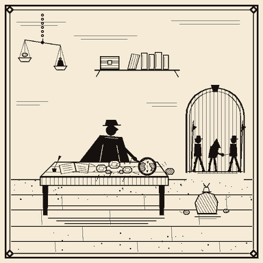

`emerald_counterfeit_scandal` · crime · weight 5 · cooldown 4h · **adminOnly** · picture: `emerald_counterfeit_scandal.png`

**Impact:** crash, peak -40%, reversal 4500s

**Markets:**

| Item | weightFactor | Direction |
|---|---|---|
| `minecraft:emerald` | 1.0 | ▼ |
| `minecraft:emerald_block` | 1.0 | ▼ |

**EN:** Inspectors have uncovered a large-scale counterfeiting ring. Confidence in emerald certificates has collapsed and villagers are refusing payment in gems until audits conclude.

Deutsch

**Gefälschte Smaragde überschwemmen den Markt!**

Inspektoren haben einen groß angelegten Fälscherring aufgedeckt. Das Vertrauen in Smaragdzertifikate ist eingebrochen, und Dorfbewohner verweigern Edelstein-Zahlungen, bis die Prüfungen abgeschlossen sind.

---

### Leaked: expedition secures massive ancient debris hoard

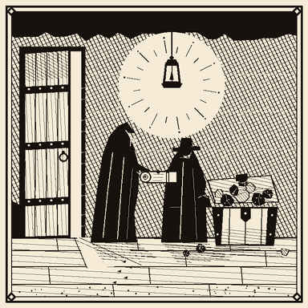

`netherite_insider_leak` · commodities · weight 3 · cooldown 8h · picture: `netherite_insider_leak.png`

**Impact:** shock, peak -30%, hold 1500s / reversal 3000s

- announce delay: insider — price moves first (15s–45s before announcement)

**Markets:**

| Item | weightFactor | Direction |
|---|---|---|
| `minecraft:netherite_ingot` | 1.0 | ▼ |
| `minecraft:netherite_scrap` | 0.8 | ▼ |
| `minecraft:ancient_debris` | 0.8 | ▼ |

**EN:** Documents leaked tonight reveal that a private expedition already secured a massive hoard of ancient debris days ago - and quietly sold ahead of the announcement. The market moved before the public ever knew.

Deutsch

**Geleakt: Expedition sichert riesigen Fund an antikem Schrott**

Heute Nacht geleakte Dokumente zeigen, dass eine private Expedition bereits vor Tagen einen riesigen Fund an antikem Schrott gesichert hat - und noch vor der Bekanntgabe still verkauft hat. Der Markt bewegte sich, bevor die Öffentlichkeit davon erfuhr.

---

### Engineering breakthrough doubles redstone efficiency!

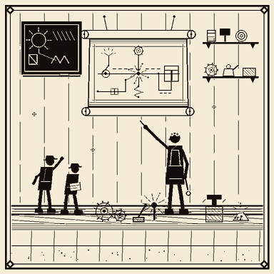

`redstone_breakthrough` · technology · weight 8 · cooldown 3h · picture: `redstone_breakthrough.png`

**Impact:** trend, peak +30%, ramp 900s / hold 2400s / reversal ramp 3000s

- announce delay: front-run window (15s–1m30s)

**Markets:**

| Item | weightFactor | Direction |
|---|---|---|
| `minecraft:redstone` | 1.0 | ▲ |

**EN:** A guild of engineers has published a compact circuit design that halves the redstone needed for common contraptions. Workshops across the land are ordering dust in bulk to retool.

Deutsch

**Technischer Durchbruch verdoppelt Redstone-Effizienz!**

Eine Ingenieursgilde hat ein kompaktes Schaltungsdesign veröffentlicht, das den Redstone-Bedarf gängiger Konstruktionen halbiert. Werkstätten im ganzen Land bestellen Staub in großen Mengen für die Umrüstung.

---

### Construction boom drives lumber demand to record highs

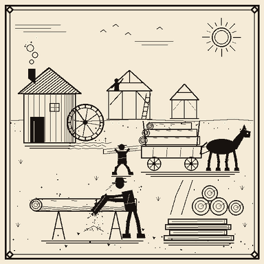

`lumber_construction_boom` · economy · weight 9 · cooldown 2h · picture: `lumber_construction_boom.png`

**Impact:** trend, peak +35%, ramp 750s / hold 2250s / reversal ramp 2250s (noise ±3%)

**Markets:**

| Item | weightFactor | Direction |
|---|---|---|
| `#minecraft:logs` | 1.0 | ▲ |
| `minecraft:*_planks` | 0.6 | ▲ |
| `minecraft:stone` | -0.15 | ▼ |

**EN:** Villages everywhere are expanding and carpenters cannot keep up. Sawmills report record order books, lifting prices across every kind of log while stone suppliers see orders quietly slip away.

Deutsch

**Bauboom treibt Holznachfrage auf Rekordhöhen**

Überall wachsen die Dörfer, und die Zimmerleute kommen nicht hinterher. Sägewerke melden Rekordaufträge, was die Preise für alle Holzarten steigen lässt, während Steinlieferanten stillschweigend Aufträge verlieren.

---

### Harvest festival drives up grain demand!

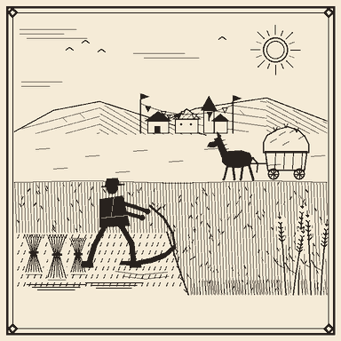

`wheat_harvest_festival` · commodities · weight 5 · cooldown 1h30m · picture: `wheat_harvest_festival.png`

**Impact:** trend, peak +22%, ramp 900s / hold 2400s / reversal ramp 2700s (noise ±4%)

**Markets:**

| Item | weightFactor | Direction |
|---|---|---|
| `minecraft:wheat` | 1.0 | ▲ |
| `minecraft:bread` | 0.6 | ▲ |

**EN:** Villages across the land are preparing for the annual harvest festival. Bakeries stockpile flour, brewers order barley in bulk, and prices for wheat and bread climb ahead of the celebrations.

Deutsch

**Erntefest treibt die Getreidenachfrage in die Höhe!**

Überall bereiten sich die Dörfer auf das jährliche Erntefest vor. Bäckereien horten Mehl, Brauer bestellen Gerste in großen Mengen, und die Preise für Weizen und Brot steigen vor den Feierlichkeiten.

---

### Locust swarm ravages farmland - staple crops in short supply!

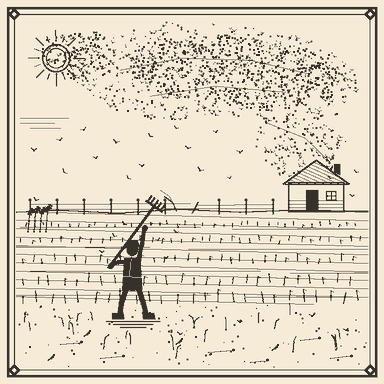

`crop_pest_outbreak` · disaster · weight 4 · cooldown 2h · picture: `crop_pest_outbreak.png`

**Impact:** shock, peak +38%, hold 1500s / reversal exponential 4500s (noise ±5%)

**Markets:**

| Item | weightFactor | Direction |
|---|---|---|
| `minecraft:wheat` | 1.0 | ▲ |
| `minecraft:potato` | 0.9 | ▲ |
| `minecraft:carrot` | 0.9 | ▲ |
| `minecraft:bread` | 0.5 | ▲ |

**EN:** A massive locust swarm has descended on the central farmlands, devouring rows of wheat, potatoes, and carrots. With the fall harvest threatened, prices for staple crops are spiking as households and merchants scramble to secure supplies.

Deutsch

**Heuschreckenschwarm verwüstet Felder - Grundnahrungsmittel werden knapp!**

Ein gewaltiger Heuschreckenschwarm hat sich über die zentralen Felder hergemacht und Weizen, Kartoffeln und Karotten kahlgefressen. Die Herbsternte steht auf der Kippe, und die Preise für Grundnahrungsmittel schießen nach oben, während Haushalte und Händler ihre Vorräte sichern.

---

### Bee colonies boom - honey floods the market

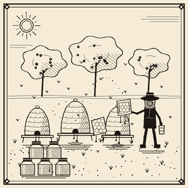

`honey_bumper_season` · commodities · weight 6 · cooldown 1h30m · picture: `honey_bumper_season.png`

**Impact:** trend, peak -22%, ramp 900s / hold 2700s / reversal ramp 2400s (noise ±3%)

**Markets:**

| Item | weightFactor | Direction |
|---|---|---|
| `minecraft:honey_bottle` | 1.0 | ▼ |
| `minecraft:honeycomb` | 0.8 | ▼ |
| `minecraft:sweet_berries` | 0.5 | ▼ |

**EN:** Beekeepers report an extraordinary season - hives are overflowing and orchards buzzing with pollinators. With honey, honeycombs and sweet berries piling up in warehouses, prices are drifting down as sellers compete for buyers.

Deutsch

**Bienenvölker im Höhenflug - Honig überschwemmt den Markt**

Imker melden eine außergewöhnliche Saison - die Stöcke laufen über, die Obstgärten summen vor Bestäubern. Da sich Honig, Waben und Süßbeeren in den Lagern stapeln, geben die Preise nach, während Verkäufer um Käufer buhlen.

---

### Massive copper seam opened in coastal cliffs!

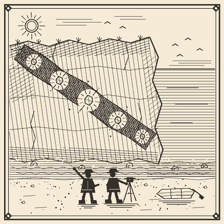

`copper_seam_discovery` · commodities · weight 8 · cooldown 1h30m · picture: `copper_seam_discovery.png`

**Impact:** trend, peak -25%, ramp 1200s / hold 3000s / reversal none (permanent)

**Markets:**

| Item | weightFactor | Direction |
|---|---|---|
| `minecraft:copper_ingot` | 1.0 | ▼ |
| `minecraft:copper_block` | 1.0 | ▼ |
| `minecraft:raw_copper` | 0.8 | ▼ |

**EN:** Surveyors have opened up a huge new copper seam running along the coastal cliffs. Foundries are queuing wagons for the fresh raw ore, and traders warn that ingots, blocks, and raw copper will all cheapen permanently as the new seam ramps up.

Deutsch

**Gewaltige Kupferader in den Küstenklippen erschlossen!**

Vermesser haben eine gewaltige neue Kupferader entlang der Küstenklippen erschlossen. Gießereien schicken Wagen um Wagen zu den frischen Rohvorkommen, und Händler warnen, dass Barren, Blöcke und Rohkupfer dauerhaft billiger werden, sobald die Ader in Produktion geht.

---

### Coal miners walk out - furnaces run cold!

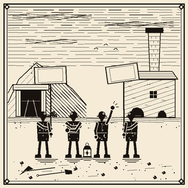

`coal_miners_strike` · labor · weight 6 · cooldown 2h · picture: `coal_miners_strike.png`

**Impact:** shock, peak +36%, hold 1800s / reversal exponential 3600s (noise ±4%)

**Markets:**

| Item | weightFactor | Direction |
|---|---|---|
| `#minecraft:coals` | 1.0 | ▲ |

**EN:** Coal miners across the region have walked off the job in protest over unsafe shafts. Furnaces are running cold, smiths are hoarding what fuel they have, and the price of coal and charcoal is climbing by the hour.

Deutsch

**Kohlekumpel legen die Arbeit nieder - Öfen bleiben kalt!**

Kohlekumpel in der ganzen Region haben aus Protest gegen unsichere Schächte die Arbeit niedergelegt. Die Öfen bleiben kalt, Schmiede horten ihren letzten Brennstoff, und die Preise für Kohle und Holzkohle klettern stündlich.

---

### Volcano erupts - villages fortify against ashfall!

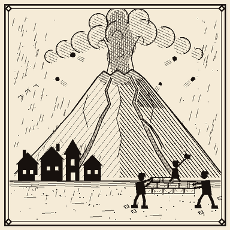

`volcanic_eruption` · disaster · weight 2 · cooldown 6h · **adminOnly** · picture: `volcanic_eruption.png`

**Impact:** shock, peak +48%, hold 2100s / reversal exponential 6000s (noise ±6%)

**Markets:**

| Item | weightFactor | Direction |
|---|---|---|
| `minecraft:obsidian` | 1.0 | ▲ |
| `minecraft:basalt` | 0.8 | ▲ |
| `minecraft:blackstone` | 0.7 | ▲ |

**EN:** A dormant volcano roared back to life overnight, blanketing the eastern reaches in ash. Villages are ordering obsidian, basalt and blackstone in bulk to reinforce shelters and dampen embers - defensive-stone traders have never seen a rush like this.

Deutsch

**Vulkan bricht aus - Dörfer verschanzen sich gegen den Ascheregen!**

Ein schlafender Vulkan ist über Nacht wieder erwacht und hat den Osten unter einer Ascheschicht begraben. Dörfer bestellen Obsidian, Basalt und Blackstone in großen Mengen, um Unterstände zu verstärken und Glutnester zu ersticken - Händler mit Verteidigungsgestein haben so einen Ansturm noch nie erlebt.

---

### Wildfires sweep the taiga - lumber prices spike!

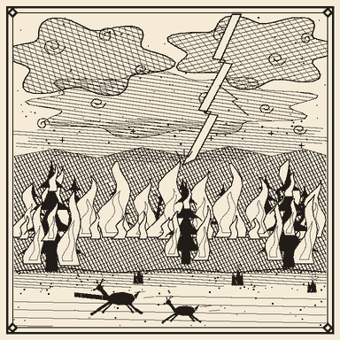

`great_forest_fire` · disaster · weight 3 · cooldown 4h · picture: `great_forest_fire.png`

**Sequences:**

- **wildfire** (pick weight 1): spark → +15% linear (300–600s) ±3% · spread → +40% linear (600–1200s) ±5% · inferno → hold (450–900s) ±7% · contained → +20% exponential (600–1200s) ±4% · settle → 0% linear (1500s)

- chains → `great_forest_fire_recovery` (on completion, 70% chance, delay 10m–30m)

**Markets:**

| Item | weightFactor | Direction |
|---|---|---|
| `#minecraft:logs` | 1.0 | ▲ |
| `minecraft:*_planks` | 0.6 | ▲ |

**EN:** Wildfires touched off by a dry lightning storm are racing through the northern taiga, consuming acres of timber a day. Sawmills warn of severe log shortages while the flames burn and orders are already being redirected to distant forests.

Deutsch

**Waldbrände fegen durch die Taiga - Holzpreise schnellen hoch!**

Waldbrände, ausgelöst durch ein trockenes Gewitter, rasen durch die nördliche Taiga und fressen täglich hektarweise Bauholz. Sägewerke warnen vor massiven Engpässen bei Baumstämmen, während die Flammen lodern, und Aufträge werden bereits in entfernte Wälder umgeleitet.

---

### Disaster relief planks flood the lumber market

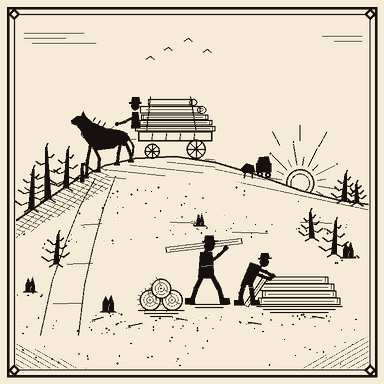

`great_forest_fire_recovery` · recovery · weight 4 · cooldown 6h · picture: `great_forest_fire_recovery.png`

**Impact:** trend, peak -18%, ramp 1200s / hold 2400s / reversal ramp 2700s (noise ±3%)

- requires `great_forest_fire` fired ≥1m ago

**Markets:**

| Item | weightFactor | Direction |
|---|---|---|
| `#minecraft:logs` | 1.0 | ▼ |
| `minecraft:*_planks` | 0.6 | ▼ |

**EN:** Emergency shipments of planks and salvaged logs from unaffected regions are pouring into the burned lands. Sawmills are running around the clock and the shortage-driven premium on lumber is unwinding rapidly.

Deutsch

**Katastrophenhilfe schwemmt den Holzmarkt**

Notlieferungen von Brettern und geborgenen Stämmen aus unversehrten Regionen strömen in die Brandgebiete. Sägewerke laufen rund um die Uhr, und der knappheitsbedingte Aufschlag auf Bauholz baut sich rasch ab.

---

### Trade council signs sweeping import tariff treaty

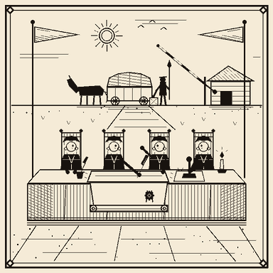

`import_tariff_treaty` · politics · weight 1 · cooldown 24h · picture: `import_tariff_treaty.png`

**Impact:** trend, peak +18%, ramp 1200s / hold 2400s / reversal none (permanent)

- fires at most once (notFired itself)

**Markets:**

| Item | weightFactor | Direction |
|---|---|---|
| `minecraft:iron_ingot` | 1.0 | ▲ |
| `minecraft:gold_ingot` | 0.8 | ▲ |

**EN:** After months of negotiation the trade council has signed a sweeping import tariff treaty on foreign metals. Cross-border shipments of iron and gold will carry a permanent surcharge - analysts expect the premium to become the new normal price.

Deutsch

**Handelsrat unterzeichnet umfassenden Einfuhrzoll-Vertrag**

Nach monatelangen Verhandlungen hat der Handelsrat einen umfassenden Einfuhrzoll-Vertrag auf ausländische Metalle unterzeichnet. Grenzüberschreitende Lieferungen von Eisen und Gold tragen künftig einen dauerhaften Aufschlag - Analysten erwarten, dass der Zuschlag zum neuen Normalpreis wird.

---

### Winter solstice gifting season lifts sweets and textiles

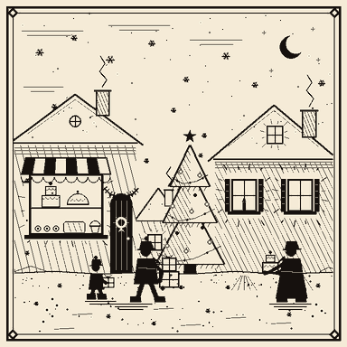

`winter_solstice_gifting` · cultural · weight 4 · cooldown 12h · picture: `winter_solstice_gifting.png`

**Impact:** trend, peak +28%, ramp 1050s / hold 2700s / reversal ramp 2400s (noise ±4%)

- chains → `post_solstice_slump` (on completion, 60% chance, delay 10m–30m, same markets)

**Markets:**

| Item | weightFactor | Direction |
|---|---|---|
| `minecraft:cake` | 1.0 | ▲ |
| `minecraft:cookie` | 0.8 | ▲ |
| `#minecraft:wool` | 0.5 | ▲ |

**EN:** The winter solstice gifting season is in full swing. Bakeries can barely keep cakes and cookies on the shelves, and dyed wool orders are stacking up in every village hall as households prepare gifts and decorations.

Deutsch

**Wintersonnenwende-Schenkzeit beflügelt Süßwaren und Textilien**

Die Schenkzeit zur Wintersonnenwende ist in vollem Gang. Bäckereien bekommen kaum genug Kuchen und Kekse ins Regal, und Bestellungen für gefärbte Wolle stapeln sich in jeder Dorfhalle, während Haushalte Geschenke und Schmuck vorbereiten.

---

### After the solstice: gift-market demand collapses

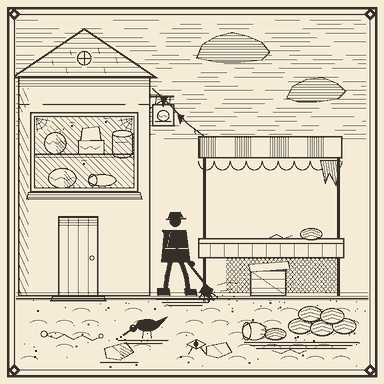

`post_solstice_slump` · cultural · weight 3 · cooldown 12h · picture: `post_solstice_slump.png`

**Impact:** crash, peak -28%, hold 1200s / reversal exponential 4500s (noise ±4%)

**Markets:**

| Item | weightFactor | Direction |
|---|---|---|
| `minecraft:cake` | 1.0 | ▼ |
| `minecraft:cookie` | 0.8 | ▼ |
| `#minecraft:wool` | 0.5 | ▼ |

**EN:** With the gifting season over, households are done buying and warehouses are still stuffed. Cakes go stale on the shelves, cookie tins gather dust, and dyed wool is discounted aggressively as merchants offload year-end stock.

Deutsch

**Nach der Sonnenwende: Nachfrage im Geschenkmarkt bricht ein**

Mit dem Ende der Schenkzeit sind die Haushalte durch, und die Lager sind noch immer voll. Kuchen werden im Regal alt, Keksdosen setzen Staub an, und gefärbte Wolle wird aggressiv verramscht, während die Händler ihre Jahresendbestände loswerden.

---

### Kingdoms race to build redstone defenses

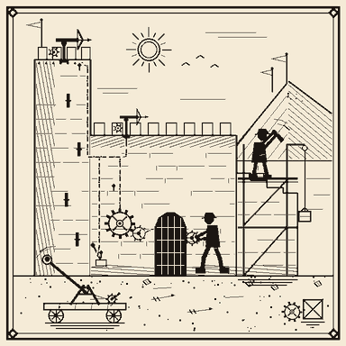

`redstone_arms_race` · conflict · weight 3 · cooldown 3h · picture: `redstone_arms_race.png`

**Sequences:**

- **escalation** (pick weight 2): arms_buildup → +30% linear (900–1800s) ±4% · peak_tension → hold (600–1200s) ±5% · ceasefire → 0% exponential (900–1500s) ±3%
- **brief_scare** (pick weight 1): alarm → +20% linear (300–600s) ±4% · denial → 0% exponential (300–600s)

**Markets:**

| Item | weightFactor | Direction |
|---|---|---|
| `minecraft:redstone` | 1.0 | ▲ |
| `minecraft:iron_ingot` | 0.5 | ▲ |

**EN:** Rival kingdoms are pouring resources into automated defenses, and their engineers are buying up every scrap of redstone and iron they can find. Speculators are jumping in behind them - traders warn the rally can just as easily fizzle out if a ceasefire is announced.

Deutsch

**Königreiche wetteifern um Redstone-Verteidigungsanlagen**

Rivalisierende Königreiche stecken massiv Mittel in automatisierte Verteidigungsanlagen, und ihre Ingenieure kaufen jeden erreichbaren Krumen Redstone und Eisen auf. Spekulanten springen hinterher - Händler warnen, dass die Rally ebenso schnell verpuffen kann, sobald ein Waffenstillstand verkündet wird.

---

## New events — Deep mining & minerals

### Nether quartz glut buries the market!

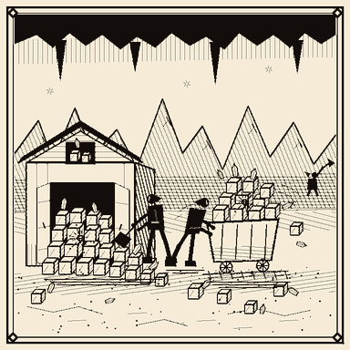

`nether_quartz_glut` · commodities · weight 8 · cooldown 2h · picture: `nether_quartz_glut.png`

**Impact:** trend, peak -28%, ramp 900s / hold 2700s / reversal ramp 2700s (noise ±4%)

**Markets:**

| Item | weightFactor | Direction |
|---|---|---|
| `minecraft:quartz` | 1.0 | ▼ |
| `minecraft:quartz_block` | 0.8 | ▼ |

**EN:** Fresh prospecting camps in the crimson wastes have flooded the caravans with nether quartz. Smelteries report warehouses filled to the rafters, and traders warn that the price of quartz and cut blocks will keep sliding for as long as the digging holds. Overmined and oversupplied, the shine has gone off the market.

Deutsch

**Netherquarz-Schwemme erdrückt den Markt!**

Neue Schürfcamps in den karmesinroten Ödländern haben die Karawanen mit Netherquarz überschwemmt. Hütten melden bis unters Dach gefüllte Lagerhallen, und Händler warnen, dass die Preise für Quarz und geschnittene Blöcke weiter fallen, solange der Abbau anhält. Überfördert und überversorgt, ist der Glanz vom Markt verschwunden.

---

### Colossal geode cracked open - amethyst everywhere!

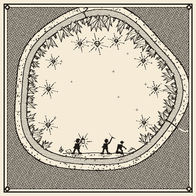

`amethyst_geode_discovery` · commodities · weight 4 · cooldown 12h · picture: `amethyst_geode_discovery.png`

**Impact:** trend, peak -30%, ramp 1200s / hold 3000s / reversal none (permanent)

**Markets:**

| Item | weightFactor | Direction |
|---|---|---|
| `minecraft:amethyst_shard` | 1.0 | ▼ |

**EN:** Miners in the deep caverns have broken into a geode the size of a village hall, its walls solid with amethyst clusters. So much crystal is now reaching the caravans that jewelers expect the glut to be permanent - the days of scarce amethyst are simply over, and the price will settle at a new, lower level for good.

Deutsch

**Gewaltige Geode aufgebrochen - überall Amethyst!**

Bergleute in den tiefen Höhlen sind in eine Geode so groß wie eine Dorfhalle vorgedrungen, deren Wände dicht mit Amethystdrusen besetzt sind. So viel Kristall erreicht nun die Karawanen, dass Juweliere von einem dauerhaften Überangebot ausgehen - die Zeiten des knappen Amethysts sind schlicht vorbei, und der Preis pendelt sich auf einem neuen, tieferen Niveau ein.

---

### Enchanting craze sends lapis demand soaring!

`lapis_enchanting_craze` · technology · weight 7 · cooldown 3h · picture: `lapis_enchanting_craze.png`

**Impact:** trend, peak +30%, ramp 900s / hold 2400s / reversal ramp 3000s (noise ±4%)

- announce delay: front-run window (15s–1m30s)

**Markets:**

| Item | weightFactor | Direction |
|---|---|---|
| `minecraft:lapis_lazuli` | 1.0 | ▲ |
| `minecraft:lapis_block` | 0.8 | ▲ |

**EN:** A new fashion for enchanted gear has swept the guild halls, and every apprentice wants a stocked enchanting table. Lapis lazuli is suddenly the ingredient nobody can keep on the shelf, and traders who read the newspaper early may position themselves before the buying frenzy fully hits the market.

Deutsch

**Verzauberungs-Manie treibt die Lapis-Nachfrage in die Höhe!**

Eine neue Mode für verzauberte Ausrüstung hat die Gildenhallen erfasst, und jeder Lehrling will einen gut bestückten Zaubertisch. Lapislazuli ist plötzlich die Zutat, die niemand mehr im Regal halten kann, und wer die Zeitung früh liest, kann sich womöglich in Stellung bringen, bevor der Kaufrausch den Markt voll erfasst.

---

### Glowstone farms flood the market with light!

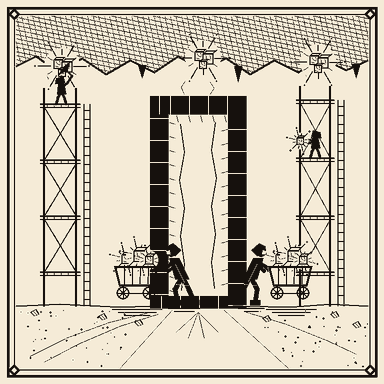

`glowstone_farm_boom` · commodities · weight 8 · cooldown 2h · picture: `glowstone_farm_boom.png`

**Impact:** trend, peak -25%, ramp 900s / hold 2400s / reversal ramp 2400s (noise ±3%)

**Markets:**

| Item | weightFactor | Direction |
|---|---|---|
| `minecraft:glowstone_dust` | 1.0 | ▼ |
| `minecraft:glowstone` | 0.8 | ▼ |

**EN:** Enterprising builders have set up sprawling glowstone harvesting operations across the nether ceilings, and the dust is now pouring back through the portals by the cartload. With supply outrunning even the busiest lamp-makers, the price of glowstone dust and blocks is drifting steadily downward.

Deutsch

**Glowstone-Farmen überschwemmen den Markt mit Licht!**

Findige Baumeister haben unter den Netherdecken weitläufige Glowstone-Ernteanlagen errichtet, und der Staub strömt nun karrenweise durch die Portale zurück. Da das Angebot selbst die fleißigsten Lampenbauer übersteigt, geben die Preise für Glowstone-Staub und -Blöcke stetig nach.

---

### Deep quarry opens - deepslate cheap for good

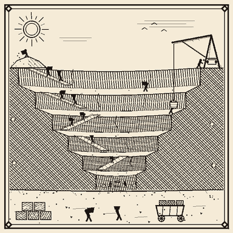

`deepslate_quarry_expansion` · economy · weight 5 · cooldown 12h · picture: `deepslate_quarry_expansion.png`

**Impact:** trend, peak -20%, ramp 1200s / hold 3000s / reversal none (permanent)

**Markets:**

| Item | weightFactor | Direction |
|---|---|---|
| `minecraft:cobbled_deepslate` | 1.0 | ▼ |
| `minecraft:deepslate` | 0.8 | ▼ |

**EN:** The trade council has bankrolled a vast quarry sunk to the deep stone layers, and cobbled deepslate now arrives in quantities the market has never seen. Analysts call it a structural shift, not a passing surplus - with the quarry running for years to come, cheap deepslate is simply the new normal.

Deutsch

**Tiefer Steinbruch erschlossen - Tiefengestein dauerhaft billig**

Der Handelsrat hat einen gewaltigen Steinbruch bis in die tiefen Gesteinsschichten finanziert, und Bruch-Tiefengestein trifft nun in nie gekannten Mengen ein. Analysten sprechen von einem strukturellen Wandel, nicht von einem vorübergehenden Überschuss - da der Steinbruch noch jahrelang läuft, ist billiges Tiefengestein schlicht der neue Normalzustand.

---

### Ocean monument stripped bare - prismarine floods in!

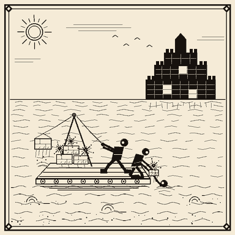

`prismarine_monument_raid` · commodities · weight 5 · cooldown 4h · picture: `prismarine_monument_raid.png`

**Impact:** shock, peak -35%, hold 1500s / reversal exponential 3600s (noise ±5%)

**Markets:**

| Item | weightFactor | Direction |
|---|---|---|
| `minecraft:prismarine_shard` | 1.0 | ▼ |
| `minecraft:prismarine_crystals` | 0.9 | ▼ |
| `minecraft:prismarine` | 0.6 | ▼ |

**EN:** A guild of divers has stormed a great ocean monument and hauled its walls to the surface overnight. Prismarine shards and crystals hit the caravans all at once, and the sudden wall of supply has sent prices plunging before sellers can even set a fair rate.

Deutsch

**Ozeanmonument leergeräumt - Prismarin überflutet den Markt!**

Eine Taucherzunft hat ein großes Ozeanmonument gestürmt und seine Wände über Nacht an die Oberfläche geschafft. Prismarinscherben und -kristalle treffen mit einem Schlag auf die Karawanen, und die plötzliche Angebotswand lässt die Preise abstürzen, noch ehe die Verkäufer einen fairen Kurs festlegen können.

---

### Cartel corners quartz supply - prices squeezed!

`quartz_cartel_squeeze` · crime · weight 3 · cooldown 8h · **adminOnly** · picture: `quartz_cartel_squeeze.png`

**Impact:** shock, peak +45%, hold 1500s / reversal exponential 3000s (noise ±5%)

**Markets:**

| Item | weightFactor | Direction |
|---|---|---|
| `minecraft:quartz` | 1.0 | ▲ |

**EN:** Word from the back rooms is that a ring of merchants has quietly bought up every quartz shipment leaving the nether portals. With the supply locked in their vaults and buyers left scrambling, the price has been squeezed sharply upward overnight - a manipulation the trade council is said to be investigating.

Deutsch

**Kartell verknappt den Quarz - Preise unter Druck!**

Aus den Hinterzimmern heißt es, ein Ring von Händlern habe still und heimlich jede Quarzlieferung aufgekauft, die die Netherportale verlässt. Da der Nachschub in ihren Gewölben liegt und die Käufer im Regen stehen, wurde der Preis über Nacht scharf nach oben getrieben - eine Manipulation, gegen die der Handelsrat angeblich bereits ermittelt.

---

### Dripstone the new fashion in grand halls!

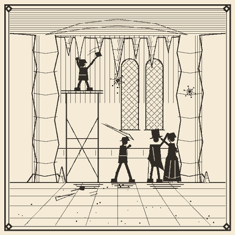

`dripstone_cavern_rush` · commodities · weight 7 · cooldown 2h · picture: `dripstone_cavern_rush.png`

**Impact:** trend, peak +28%, ramp 900s / hold 2400s / reversal ramp 2700s (noise ±3%)

**Markets:**

| Item | weightFactor | Direction |
|---|---|---|
| `minecraft:dripstone_block` | 1.0 | ▲ |
| `minecraft:pointed_dripstone` | 0.7 | ▲ |

**EN:** Master builders have taken to lining grand halls with dripstone columns, and every noble house wants the dramatic cavern look for its own. Demand for dripstone blocks and pointed spikes is climbing steadily as masons compete for the fashionable stone.

Deutsch

**Tropfstein wird zur neuen Mode in den Prunkhallen!**

Baumeister haben begonnen, Prunkhallen mit Tropfsteinsäulen auszukleiden, und jedes Adelshaus will den dramatischen Höhlenlook für sich. Die Nachfrage nach Tropfsteinblöcken und spitzem Tropfstein steigt stetig, während Steinmetze um das modische Gestein wetteifern.

---

### Tuff-and-calcite facades sweep the townhouses

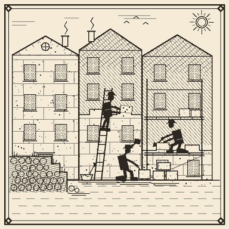

`tuff_facade_fashion` · cultural · weight 6 · cooldown 3h · picture: `tuff_facade_fashion.png`

**Impact:** trend, peak +30%, ramp 900s / hold 2400s / reversal ramp 2700s (noise ±3%)

**Markets:**

| Item | weightFactor | Direction |
|---|---|---|
| `minecraft:tuff` | 1.0 | ▲ |
| `minecraft:calcite` | 0.8 | ▲ |
| `minecraft:cobblestone` | -0.15 | ▼ |

**EN:** A wave of taste for pale tuff-and-calcite facades has swept the townhouses, and masons cannot cut the mottled stone fast enough. As tuff and calcite climb, plain cobblestone is quietly falling out of favor - the humble grey walls now read as old-fashioned and their price drifts lower.

Deutsch

**Tuff-und-Kalzit-Fassaden erobern die Stadthäuser**

Eine Modewelle für helle Tuff-und-Kalzit-Fassaden hat die Stadthäuser erfasst, und die Steinmetze kommen mit dem Zuschneiden des gesprenkelten Gesteins kaum nach. Während Tuff und Kalzit steigen, gerät schlichtes Kopfsteinpflaster still aus der Mode - die biederen grauen Mauern gelten nun als altbacken, und ihr Preis gibt nach.

---

### Speculators pile into amethyst on wild rumors!

`amethyst_speculation` · rumors · weight 6 · cooldown 3h · picture: `amethyst_speculation.png`

**Sequences:**

- **pump_and_dump** (pick weight 2): hype → +40% linear (450–1200s) ±5% · peak → hold (300–600s) ±8% · sell_off → -15% exponential (100–300s) ±4% · recover → 0% linear (1500s)
- **fizzle** (pick weight 1): stir → +15% linear (300–600s) ±4% · denial → 0% exponential (300–900s)

**Markets:**

| Item | weightFactor | Direction |
|---|---|---|
| `minecraft:amethyst_shard` | 1.0 | ▲ |

**EN:** Whispers of a secret royal amethyst commission have traders bidding the crystal up hard, though nobody can name a source. Seasoned brokers caution that speculation like this often peaks in a frenzy and collapses just as fast - and sometimes the story never gets off the ground at all.

Deutsch

**Spekulanten stürzen sich auf Amethyst - wilde Gerüchte!**

Gerüchte über einen geheimen königlichen Amethyst-Auftrag treiben die Händler dazu, den Kristall kräftig hochzubieten, auch wenn niemand eine Quelle nennen kann. Erfahrene Makler warnen, dass solche Spekulationen oft in einem Rausch gipfeln und ebenso schnell zusammenbrechen - und manchmal kommt die Geschichte gar nicht erst in Fahrt.

---

## New events — Agriculture & food

### Blight returns to the potato fields!

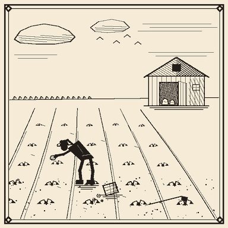

`potato_blight_return` · disaster · weight 4 · cooldown 2h · picture: `potato_blight_return.png`

**Impact:** shock, peak +40%, hold 1500s / reversal exponential 3600s (noise ±5%)

**Markets:**

| Item | weightFactor | Direction |
|---|---|---|
| `minecraft:potato` | 1.0 | ▲ |
| `minecraft:baked_potato` | 0.6 | ▲ |

**EN:** The dreaded blight has crept back into the potato fields overnight, blackening entire rows before the farmers could react. With the storehouses barely half full, prices for potatoes and baked potatoes are shooting up as households rush to secure what little remains.

Deutsch

**Krautfäule kehrt auf die Kartoffelfelder zurück!**

Über Nacht hat sich die gefürchtete Krautfäule zurück auf die Kartoffelfelder geschlichen und ganze Reihen geschwärzt, ehe die Bauern reagieren konnten. Da die Vorratshäuser kaum halb voll sind, schießen die Preise für Kartoffeln und Ofenkartoffeln in die Höhe, während die Haushalte sich um die letzten Reste reißen.

---

### Autumn festival lifts the pumpkin trade!

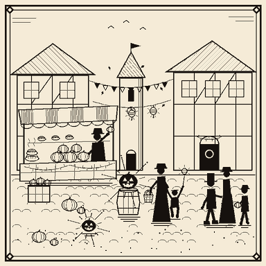

`pumpkin_autumn_festival` · cultural · weight 5 · cooldown 12h · picture: `pumpkin_autumn_festival.png`

**Impact:** trend, peak +25%, ramp 1050s / hold 2400s / reversal ramp 2700s (noise ±4%)

**Markets:**

| Item | weightFactor | Direction |
|---|---|---|
| `minecraft:pumpkin` | 1.0 | ▲ |
| `minecraft:pumpkin_pie` | 0.7 | ▲ |
| `minecraft:carved_pumpkin` | 0.5 | ▲ |
| `minecraft:cake` | -0.15 | ▼ |

**EN:** The annual autumn festival is upon us and every village square is being decked out with lanterns and pies. Bakers cannot bake pumpkin pie fast enough, carvers are besieged for jack-o'-lanterns, and prices for pumpkins climb steadily through the season while the ordinary cake stalls stand quiet.

Deutsch

**Herbstfest belebt den Kürbishandel!**

Das alljährliche Herbstfest steht vor der Tür, und auf jedem Dorfplatz werden Laternen und Kuchen ausgestellt. Die Bäcker kommen mit dem Kürbiskuchen nicht hinterher, die Schnitzer werden nach Kürbislaternen belagert, und die Kürbispreise klettern die Saison über stetig, während die gewöhnlichen Kuchenstände leer bleiben.

---

### Bumper summer floods the market with melons

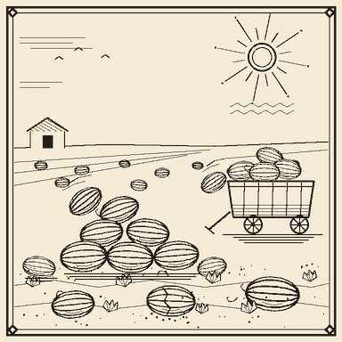

`melon_summer_glut` · commodities · weight 6 · cooldown 6h · picture: `melon_summer_glut.png`

**Impact:** trend, peak -22%, ramp 900s / hold 2700s / reversal ramp 2400s (noise ±3%)

**Markets:**

| Item | weightFactor | Direction |
|---|---|---|
| `minecraft:melon_slice` | 1.0 | ▼ |
| `minecraft:melon` | 0.7 | ▼ |

**EN:** A long, warm summer has left the melon patches groaning under the weight of the harvest. Carts of fruit arrive at market faster than the stalls can sell them, and with warehouses stuffed to the rafters the price of melons and melon slices is sliding lower by the day.

Deutsch

**Rekordsommer überschwemmt den Markt mit Melonen**

Ein langer, warmer Sommer hat die Melonenfelder unter der Last der Ernte ächzen lassen. Wagen um Wagen voller Früchte erreicht den Markt schneller, als die Stände sie verkaufen können, und da die Lager bis unter das Dach gefüllt sind, rutscht der Preis für Melonen und Melonenscheiben von Tag zu Tag tiefer.

---

### New river plantations turn sugar cane cheap for good

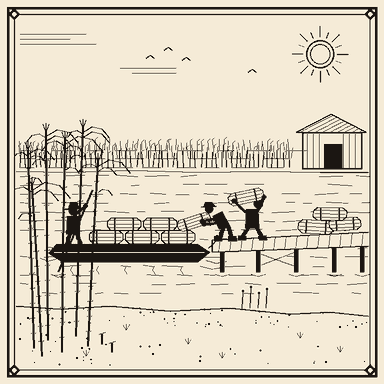

`sugarcane_plantation_boom` · economy · weight 5 · cooldown 24h · picture: `sugarcane_plantation_boom.png`

**Impact:** trend, peak -25%, ramp 1200s / hold 3000s / reversal none (permanent)

**Markets:**

| Item | weightFactor | Direction |
|---|---|---|
| `minecraft:sugar_cane` | 1.0 | ▼ |
| `minecraft:sugar` | 0.8 | ▼ |
| `minecraft:paper` | 0.4 | ▼ |

**EN:** Vast new sugar-cane plantations have been established along the great river deltas, and the first barges are already arriving. The trade council expects the flood of cane to hold indefinitely, pressing the prices of sugar cane, refined sugar, and paper down to a permanently lower level.

Deutsch

**Neue Flussplantagen machen Zuckerrohr dauerhaft billig**

Entlang der großen Flussdeltas sind weite neue Zuckerrohrplantagen entstanden, und die ersten Kähne treffen bereits ein. Der Handelsrat rechnet damit, dass die Rohrschwemme auf Dauer anhält, und drückt die Preise für Zuckerrohr, raffinierten Zucker und Papier auf ein dauerhaft niedrigeres Niveau.

---

### Southern trade route opens the cocoa floodgates

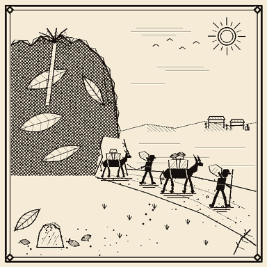

`cocoa_trade_route_opens` · commodities · weight 7 · cooldown 3h · picture: `cocoa_trade_route_opens.png`

**Impact:** trend, peak -28%, ramp 900s / hold 2400s / reversal ramp 2700s (noise ±3%)

**Markets:**

| Item | weightFactor | Direction |
|---|---|---|
| `minecraft:cocoa_beans` | 1.0 | ▼ |

**EN:** A new caravan route through the southern jungles has finally been secured, and the first shipments of cocoa beans are pouring into the northern markets. With supply suddenly abundant, cocoa prices are drifting lower as chocolatiers stock up while the going is cheap.

Deutsch

**Südliche Handelsroute öffnet die Kakaoschleusen**

Eine neue Karawanenroute durch die südlichen Dschungel ist endlich gesichert, und die ersten Ladungen Kakaobohnen strömen in die nördlichen Märkte. Da das Angebot plötzlich reichlich ist, geben die Kakaopreise nach, während sich die Chocolatiers eindecken, solange es günstig ist.

---

### Foraging craze sends mushroom prices soaring

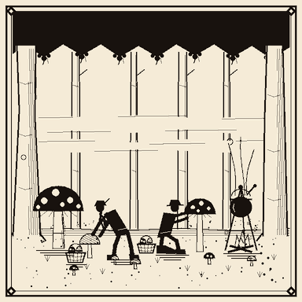

`mushroom_foraging_craze` · commodities · weight 6 · cooldown 2h · picture: `mushroom_foraging_craze.png`

**Impact:** trend, peak +24%, ramp 900s / hold 2400s / reversal ramp 2700s (noise ±4%)

**Markets:**

| Item | weightFactor | Direction |
|---|---|---|
| `minecraft:red_mushroom` | 1.0 | ▲ |
| `minecraft:brown_mushroom` | 1.0 | ▲ |
| `minecraft:mushroom_stew` | 0.6 | ▲ |
| `minecraft:bread` | -0.2 | ▼ |

**EN:** A craze for wild mushroom stew has gripped the villages, and every innkeeper wants red and brown caps by the basketful. Prices for both mushrooms and ready-made stew are climbing fast, while the bakers grumble that villagers off foraging in the woods are buying far less bread.

Deutsch

**Sammelfieber treibt die Pilzpreise nach oben**

Ein Fieber nach Waldpilzeintopf hat die Dörfer erfasst, und jeder Wirt will rote und braune Kappen körbeweise. Die Preise für beide Pilzsorten und für fertigen Eintopf steigen rasch, während die Bäcker murren, dass die Dorfbewohner beim Pilzesammeln im Wald weit weniger Brot kaufen.

---

### Brewers empty the nether wart stocks!

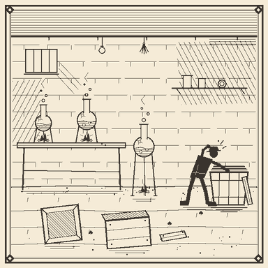

`netherwart_brewing_shortage` · commodities · weight 5 · cooldown 3h · picture: `netherwart_brewing_shortage.png`

**Impact:** shock, peak +42%, hold 1500s / reversal exponential 3600s (noise ±5%)

**Markets:**

| Item | weightFactor | Direction |
|---|---|---|
| `minecraft:nether_wart` | 1.0 | ▲ |
| `minecraft:sugar` | -0.2 | ▼ |
| `minecraft:glowstone_dust` | -0.15 | ▼ |

**EN:** A surge in potion demand has seen the brewers' guild buy up every last crate of nether wart, and the fortress caravans cannot resupply fast enough. Nether wart prices have spiked overnight, while sugar and glowstone dust sag as half-finished brews sit idle without their base ingredient.

Deutsch

**Brauer räumen die Netherwarzen-Lager leer!**

Ein sprunghaft gestiegener Trankbedarf hat die Brauergilde jede letzte Kiste Netherwarzen aufkaufen lassen, und die Festungskarawanen kommen mit dem Nachschub nicht hinterher. Die Netherwarzenpreise sind über Nacht in die Höhe geschnellt, während Zucker und Leuchtsteinstaub nachgeben, weil halbfertige Gebräue ohne ihre Grundzutat brachliegen.

---

### Record beetroot harvest weighs on prices

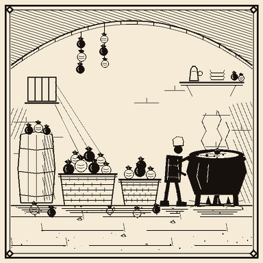

`beetroot_harvest_surplus` · commodities · weight 6 · cooldown 2h · picture: `beetroot_harvest_surplus.png`

**Impact:** trend, peak -20%, ramp 900s / hold 2700s / reversal ramp 2400s (noise ±3%)

**Markets:**

| Item | weightFactor | Direction |
|---|---|---|
| `minecraft:beetroot` | 1.0 | ▼ |
| `minecraft:beetroot_soup` | 0.6 | ▼ |

**EN:** Growers report a record beetroot harvest this year, with cellars overflowing and soup kitchens spoiled for choice. As the surplus works its way through the market, prices for beetroot and beetroot soup are easing steadily lower.

Deutsch

**Rekord-Rübenernte drückt die Preise**

Die Anbauer melden in diesem Jahr eine Rekordernte an Roten Rüben, die Keller quellen über und die Suppenküchen haben die Qual der Wahl. Während sich der Überschuss durch den Markt arbeitet, geben die Preise für Rote Rüben und Rübensuppe stetig nach.

---

### Great drought scorches the croplands!

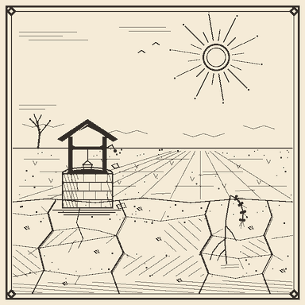

`great_drought` · disaster · weight 3 · cooldown 6h · picture: `great_drought.png`

**Impact:** shock, peak +40%, hold 1800s / reversal exponential 4500s (noise ±5%)

- records `climate`=`drought`
- chains → `grain_relief_convoy` (on completion, 70% chance, delay 10m–30m)

**Markets:**

| Item | weightFactor | Direction |
|---|---|---|
| `minecraft:wheat` | 1.0 | ▲ |
| `minecraft:potato` | 0.9 | ▲ |
| `minecraft:carrot` | 0.9 | ▲ |
| `minecraft:beetroot` | 0.8 | ▲ |

**EN:** Weeks without rain have turned the croplands to dust, and the wells are running dangerously low. Wheat wilts in the fields, root crops shrivel underground, and prices for every staple are surging as farmers and merchants brace for a hungry season.

Deutsch

**Große Dürre verdorrt das Ackerland!**

Wochen ohne Regen haben das Ackerland zu Staub werden lassen, und die Brunnen versiegen bedenklich. Der Weizen verwelkt auf den Feldern, die Wurzelfrüchte verkümmern im Boden, und die Preise für alle Grundnahrungsmittel schnellen empor, während sich Bauern und Händler auf eine hungrige Zeit einstellen.

---

### Relief caravans pour grain into the stricken markets

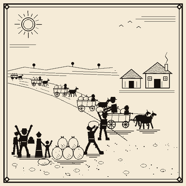

`grain_relief_convoy` · recovery · weight 0 · cooldown 6h · picture: `grain_relief_convoy.png`

**Impact:** trend, peak -20%, ramp 1200s / hold 2400s / reversal ramp 2700s (noise ±3%)

- requires `great_drought` fired ≥1m ago

**Markets:**

| Item | weightFactor | Direction |
|---|---|---|
| `minecraft:wheat` | 1.0 | ▼ |
| `minecraft:potato` | 0.9 | ▼ |
| `minecraft:carrot` | 0.9 | ▼ |
| `minecraft:beetroot` | 0.8 | ▼ |

**EN:** Long relief caravans from the untouched river provinces are rolling into the drought-stricken markets, their wagons heavy with grain and root crops. As the sacks pile up on the market squares, the shortage premium on staples is unwinding and prices are settling back toward normal.

Deutsch

**Hilfskarawanen schütten Getreide in die notleidenden Märkte**

Lange Hilfskarawanen aus den verschonten Flussprovinzen rollen in die von der Dürre gezeichneten Märkte, die Wagen schwer beladen mit Getreide und Wurzelfrüchten. Während sich die Säcke auf den Marktplätzen stapeln, baut sich der knappheitsbedingte Aufschlag auf Grundnahrungsmittel ab, und die Preise pendeln sich wieder auf normalem Niveau ein.

---

## New events — Livestock, fishing & textiles

### Spring shearing floods the wool market

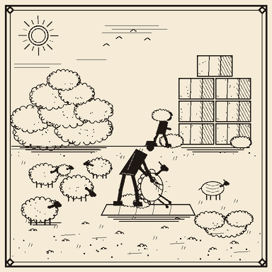

`spring_shearing_glut` · commodities · weight 6 · cooldown 2h · picture: `spring_shearing_glut.png`

**Impact:** trend, peak -24%, ramp 900s / hold 2400s / reversal ramp 2700s (noise ±4%)

**Markets:**

| Item | weightFactor | Direction |
|---|---|---|
| `minecraft:string` | 0.5 | ▼ |
| `#minecraft:wool` | 1.0 | ▼ |
| `minecraft:leather` | -0.3 | ▲ |

**EN:** The first warm days brought every shepherd's flock to the shears at once, and bales of fresh fleece are piling up faster than the weavers can spin them. Wool and raw thread are drifting cheaper by the day as sellers undercut one another at the gate. Tanners, meanwhile, note that buyers are quietly turning back to leather for their finer garments.

Deutsch

**Frühjahrsschur überschwemmt den Wollmarkt**

Die ersten warmen Tage haben die Herden aller Schäfer zugleich unter die Schere gebracht, und Ballen frischer Wolle stapeln sich schneller, als die Weber sie verspinnen können. Wolle und Rohgarn werden von Tag zu Tag billiger, während die Verkäufer sich am Tor gegenseitig unterbieten. Gerber wiederum bemerken, dass sich die Käufer für ihre feineren Gewänder still wieder dem Leder zuwenden.

---

### New tanneries drive a run on leather

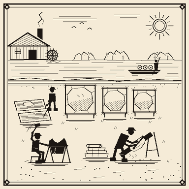

`leather_tannery_boom` · economy · weight 7 · cooldown 2h · picture: `leather_tannery_boom.png`

**Impact:** trend, peak +30%, ramp 750s / hold 2400s / reversal ramp 2700s (noise ±3%)

**Markets:**

| Item | weightFactor | Direction |
|---|---|---|
| `minecraft:leather` | 1.0 | ▲ |
| `#minecraft:wool` | -0.25 | ▼ |

**EN:** A cluster of new tanneries has opened along the river, and their appetite for hides is reshaping the whole leather trade. Saddlers, bookbinders and armourers are all bidding against one another, and prices are climbing steadily. Wool merchants grumble that the fashion for tooled leather is pulling custom away from their looms.

Deutsch

**Neue Gerbereien lösen einen Ansturm auf Leder aus**

Entlang des Flusses hat eine Reihe neuer Gerbereien eröffnet, und ihr Hunger nach Häuten krempelt den gesamten Lederhandel um. Sattler, Buchbinder und Waffenschmiede überbieten sich gegenseitig, und die Preise klettern stetig. Wollhändler murren, dass die Mode für gepunztes Leder ihnen die Kundschaft von den Webstühlen zieht.

---

### Cattle plague fells the herds - meat and hides grow scarce!

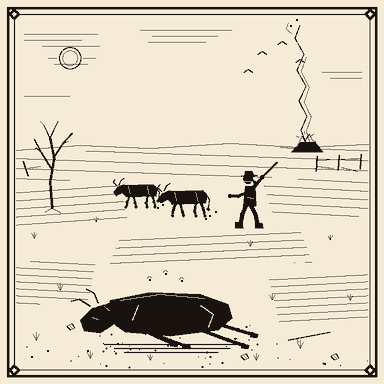

`cattle_plague_outbreak` · disaster · weight 3 · cooldown 6h · **adminOnly** · picture: `cattle_plague_outbreak.png`

**Impact:** shock, peak +42%, hold 1800s / reversal exponential 4500s (noise ±5%)

**Markets:**

| Item | weightFactor | Direction |
|---|---|---|
| `minecraft:beef` | 1.0 | ▲ |
| `minecraft:milk_bucket` | 0.7 | ▲ |
| `minecraft:leather` | 0.5 | ▲ |

**EN:** A murrain sweeping the pasturelands has felled entire herds within days, and drovers are burning carcasses to halt its spread. With beef, milk and hides all vanishing from the stalls at once, prices have lurched upward and butchers are turning buyers away. Herders warn the shortage will bite hardest before the surviving stock can recover.

Deutsch

**Rinderseuche rafft die Herden dahin - Fleisch und Häute werden knapp!**

Eine Viehseuche fegt über die Weidegründe und hat binnen Tagen ganze Herden dahingerafft; Treiber verbrennen die Kadaver, um ihre Ausbreitung zu stoppen. Da Rindfleisch, Milch und Häute zugleich aus den Ständen verschwinden, sind die Preise nach oben gesprungen, und Metzger weisen ihre Kundschaft ab. Hirten warnen, dass die Knappheit am härtesten zuschlägt, bevor sich der überlebende Bestand erholen kann.

---

### Great salmon run fills the nets

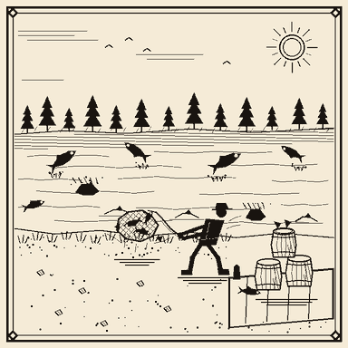

`salmon_spawning_run` · commodities · weight 6 · cooldown 1h30m · picture: `salmon_spawning_run.png`

**Impact:** trend, peak -25%, ramp 900s / hold 2700s / reversal ramp 2400s (noise ±4%)

**Markets:**

| Item | weightFactor | Direction |
|---|---|---|
| `minecraft:salmon` | 1.0 | ▼ |
| `minecraft:cooked_salmon` | 0.6 | ▼ |

**EN:** The rivers are thick with the seasonal salmon run, and the fishing fleets are hauling in more than the smokehouses can cure. Barrels of fresh and cooked salmon are stacking up on every quay, and prices are sliding as the catch outpaces demand. Old hands know the glut lasts only as long as the fish keep running.

Deutsch

**Großer Lachszug füllt die Netze**

Die Flüsse sind dicht vom jahreszeitlichen Lachszug, und die Fischerflotten holen mehr ein, als die Räuchereien pökeln können. Fässer mit frischem und gebratenem Lachs stapeln sich an jedem Kai, und die Preise rutschen, da der Fang die Nachfrage übertrifft. Alte Hasen wissen, dass die Schwemme nur so lange anhält, wie die Fische ziehen.

---

### Overfishing collapses the cod grounds for good

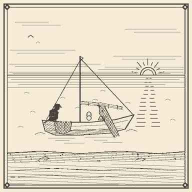

`cod_overfishing_crisis` · disaster · weight 3 · cooldown 24h · picture: `cod_overfishing_crisis.png`

**Impact:** trend, peak +30%, ramp 1200s / hold 3000s / reversal none (permanent)

**Markets:**

| Item | weightFactor | Direction |
|---|---|---|
| `minecraft:cod` | 1.0 | ▲ |
| `minecraft:cooked_cod` | 0.6 | ▲ |

**EN:** Years of dragging the shoals dry have finally emptied the great cod grounds, and this season the fleets returned with holds barely half full. Fishmongers say the collapse is no passing lean spell but a lasting one - the breeding stock is simply gone. Prices for cod, fresh and cooked, have settled onto a permanently higher shelf.

Deutsch

**Überfischung lässt die Dorschgründe für immer zusammenbrechen**

Jahrelanges Leerfischen der Schwärme hat die großen Dorschgründe endgültig ausgezehrt, und diese Saison kehrten die Flotten mit kaum halb gefüllten Laderäumen zurück. Fischhändler sagen, der Zusammenbruch sei keine vorübergehende Flaute, sondern von Dauer - der Laichbestand ist schlicht dahin. Die Preise für Dorsch, frisch wie gebraten, haben sich auf einem dauerhaft höheren Niveau eingependelt.

---

### Aquarium fad grips the wealthy

`tropical_fish_aquarium_fad` · cultural · weight 5 · cooldown 3h · picture: `tropical_fish_aquarium_fad.png`

**Impact:** trend, peak +32%, ramp 900s / hold 2400s / reversal ramp 2700s (noise ±4%)

**Markets:**

| Item | weightFactor | Direction |
|---|---|---|
| `minecraft:tropical_fish` | 1.0 | ▲ |

**EN:** A craze for glass tanks of glittering tropical fish has swept the manor houses, and no gentry parlour is complete without one. Collectors are paying dizzying sums for the brightest specimens, and divers cannot bring them ashore fast enough. Prices for tropical fish are climbing as fast as the fashion spreads.

Deutsch

**Aquarienmode packt die Wohlhabenden**

Eine Begeisterung für gläserne Becken mit schillernden tropischen Fischen hat die Herrenhäuser erfasst, und kein Salon der feinen Leute kommt mehr ohne eines aus. Sammler zahlen schwindelerregende Summen für die prächtigsten Exemplare, und die Taucher bringen sie kaum schnell genug an Land. Die Preise für tropische Fische klettern so rasch, wie sich die Mode verbreitet.

---

### Henhouse fire wipes out laying flocks - eggs vanish!

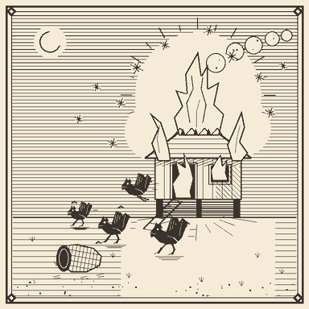

`henhouse_fire_egg_shortage` · disaster · weight 4 · cooldown 2h · picture: `henhouse_fire_egg_shortage.png`

**Impact:** shock, peak +40%, hold 1500s / reversal exponential 3600s (noise ±5%)

- announce delay: insider — price moves first (15s–45s before announcement)

**Markets:**

| Item | weightFactor | Direction |
|---|---|---|
| `minecraft:egg` | 1.0 | ▲ |

**EN:** A fire that tore through the district's henhouses overnight has left the laying flocks in ashes, and baskets stood empty at market before word of the blaze had even spread. Bakers scrambling for eggs found prices already leaping, as if the shortage had been felt before it was announced. It will be weeks before new pullets come into lay.

Deutsch

**Hühnerstallbrand vernichtet die Legescharen - Eier verschwinden!**

Ein Feuer, das über Nacht durch die Hühnerställe des Viertels raste, hat die Legescharen in Asche gelegt, und die Körbe standen schon leer am Markt, ehe sich die Kunde vom Brand überhaupt verbreitet hatte. Bäcker, die nach Eiern jagten, fanden die Preise bereits im Sprung vor, als hätte man die Knappheit gespürt, bevor sie verkündet wurde. Es wird Wochen dauern, bis neue Junghennen zu legen beginnen.

---

### Archery muster empties the fletchers' feather stores

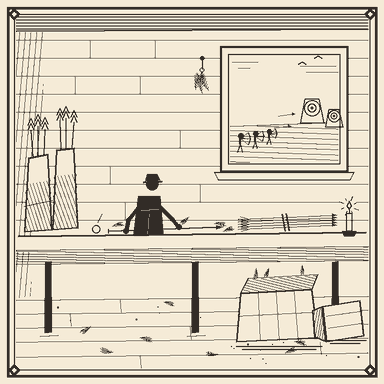

`fletcher_feather_demand` · conflict · weight 5 · cooldown 2h · picture: `fletcher_feather_demand.png`

**Impact:** trend, peak +28%, ramp 750s / hold 2250s / reversal ramp 2700s (noise ±3%)

**Markets:**

| Item | weightFactor | Direction |
|---|---|---|
| `minecraft:feather` | 1.0 | ▲ |

**EN:** With the muster called and every able archer ordered to the butts, the fletchers are working through the night and their bins of goose feathers are running dry. Buyers are offering above the going rate for any bundle of quills that comes to market. Until the flocks moult again, feathers will stay dear.

Deutsch

**Bogenschützen-Aufgebot leert die Federlager der Pfeilmacher**

Da das Aufgebot einberufen und jeder taugliche Bogenschütze an die Schießstände beordert ist, arbeiten die Pfeilmacher die Nächte durch, und ihre Kästen mit Gänsefedern laufen leer. Käufer bieten über dem üblichen Preis für jedes Bündel Federkiele, das auf den Markt kommt. Bis die Schwärme wieder mausern, bleiben Federn teuer.

---

### Black-dye trade collapses as fashion turns pale

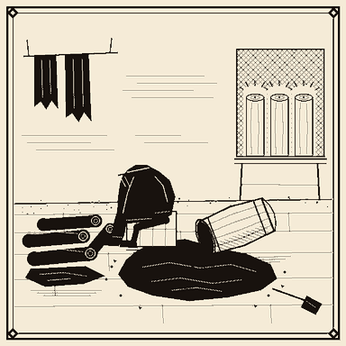

`ink_dye_market_crash` · markets · weight 4 · cooldown 4h · picture: `ink_dye_market_crash.png`

**Impact:** crash, peak -40%, hold 900s / reversal exponential 6000s (noise ±4%)

**Markets:**

| Item | weightFactor | Direction |
|---|---|---|
| `minecraft:ink_sac` | 1.0 | ▼ |
| `minecraft:black_dye` | 0.8 | ▼ |
| `minecraft:white_dye` | -0.3 | ▲ |

**EN:** The season's taste has swung hard toward pale and undyed cloth, and the once-coveted black dye has fallen out of favour overnight. Warehouses full of ink sacs and finished black dye have lost their buyers, and dyers are dumping stock at any price. Pale and white dyes, by contrast, are suddenly the colour everyone wants.

Deutsch

**Handel mit Schwarzfärbemitteln bricht ein, als die Mode ins Helle kippt**

Der Geschmack der Saison ist hart zu blassem und ungefärbtem Tuch umgeschwenkt, und das einst begehrte Schwarz ist über Nacht aus der Mode gefallen. Lagerhäuser voller Tintenbeutel und fertigem Schwarzfärbemittel haben ihre Käufer verloren, und die Färber verramschen ihre Bestände zu jedem Preis. Blasse und weiße Farben hingegen sind mit einem Mal das, was alle wollen.

---

### Winter craze for rabbit stew empties the warrens

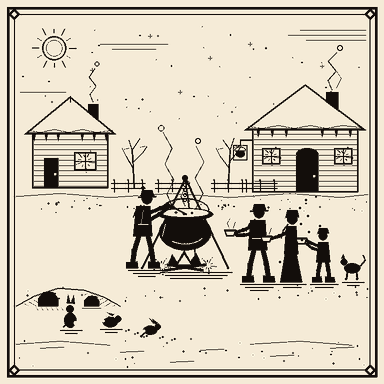

`rabbit_stew_winter_craze` · cultural · weight 4 · cooldown 12h · picture: `rabbit_stew_winter_craze.png`

**Impact:** trend, peak +30%, ramp 1050s / hold 2700s / reversal ramp 2400s (noise ±4%)

**Markets:**

| Item | weightFactor | Direction |
|---|---|---|
| `minecraft:rabbit` | 1.0 | ▲ |
| `minecraft:cooked_rabbit` | 0.7 | ▲ |
| `minecraft:rabbit_hide` | 0.4 | ▲ |
| `minecraft:mutton` | -0.25 | ▼ |

**EN:** A hard frost and a fashion for hot rabbit stew have set every inn and household clamouring for coneys, and the warrens can scarcely keep up. Rabbit, cooked meat and even hides for winter linings are all fetching more by the week. Mutton sellers complain that the stewpots have stolen their custom for the season.

Deutsch

**Winterrausch um Kanincheneintopf leert die Bauten**

Ein strenger Frost und die Mode für heißen Kanincheneintopf haben jedes Wirtshaus und jeden Haushalt nach Karnickeln lärmen lassen, und die Bauten kommen kaum nach. Kaninchen, gebratenes Fleisch und selbst Felle für Winterfütterungen erzielen Woche für Woche mehr. Hammelverkäufer beklagen, dass ihnen die Eintopftöpfe für diese Saison die Kundschaft gestohlen haben.

---

## New events — Nether & End frontier

### Alchemists' guild empties the blaze-rod stalls!

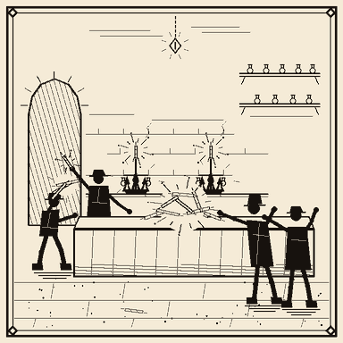

`blaze_rod_brewing_rush` · commodities · weight 6 · cooldown 3h · picture: `blaze_rod_brewing_rush.png`

**Impact:** trend, peak +32%, ramp 900s / hold 2400s / reversal ramp 2700s (noise ±4%)

**Markets:**

| Item | weightFactor | Direction |
|---|---|---|
| `minecraft:blaze_rod` | 1.0 | ▲ |
| `minecraft:blaze_powder` | 0.7 | ▲ |

**EN:** The alchemists' guild has placed a standing order for every blaze rod the delvers can drag back from the Nether. Brewing stands are firing day and night, and rod and powder alike are climbing as the guild's buyers outbid one another.

Deutsch

**Alchemistengilde leert die Lohenruten-Stände!**

Die Alchemistengilde hat eine Dauerbestellung auf jede Lohenrute aufgegeben, die die Delver aus dem Nether schleppen können. Die Braustände laufen Tag und Nacht, und sowohl Ruten als auch Staub steigen, während sich die Einkäufer der Gilde gegenseitig überbieten.

---

### Expedition fever drives ender-pearl demand sky-high

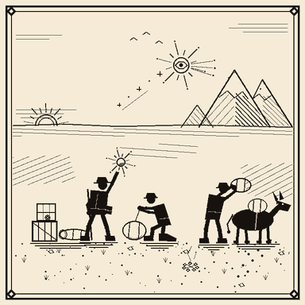

`ender_pearl_expedition_boom` · commodities · weight 6 · cooldown 3h · picture: `ender_pearl_expedition_boom.png`

**Impact:** trend, peak +28%, ramp 900s / hold 2100s / reversal ramp 2700s (noise ±4%)

**Markets:**

| Item | weightFactor | Direction |
|---|---|---|
| `minecraft:ender_pearl` | 1.0 | ▲ |
| `minecraft:ender_eye` | 0.6 | ▲ |

**EN:** A wave of frontier expeditions is setting out for the far reaches, and every party wants pearls for the leap home. With ender eyes needed to chart the way, brokers report pearls and eyes alike snapped up faster than the delvers can gather them.

Deutsch

**Expeditionsfieber treibt die Nachfrage nach Enderperlen in die Höhe**

Eine Welle von Grenzland-Expeditionen bricht in die fernen Weiten auf, und jede Gruppe will Perlen für den Sprung nach Hause. Da auch Enderaugen zum Kartieren des Weges gebraucht werden, melden Makler, dass Perlen und Augen schneller vergriffen sind, als die Delver sie sammeln können.

---

### Apothecaries bid up ghast tears for healing tonics!

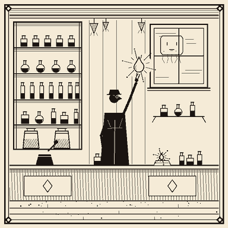

`ghast_tear_apothecary_craze` · commodities · weight 4 · cooldown 4h · picture: `ghast_tear_apothecary_craze.png`

**Impact:** shock, peak +40%, hold 1500s / reversal exponential 3600s (noise ±5%)

**Markets:**

| Item | weightFactor | Direction |
|---|---|---|
| `minecraft:ghast_tear` | 1.0 | ▲ |

**EN:** A sudden craze for regeneration tonics has the apothecaries' guild bidding furiously on every ghast tear that reaches the market. Brave delvers who face the wailing beasts of the Nether are being paid a king's ransom, and prices have spiked overnight.

Deutsch

**Apotheker treiben die Preise für Ghast-Tränen für Heiltränke hoch!**

Ein plötzlicher Rausch um Regenerationstränke lässt die Apothekergilde erbittert um jede Ghast-Träne bieten, die den Markt erreicht. Mutige Delver, die sich den heulenden Bestien des Nethers stellen, werden fürstlich entlohnt, und die Preise sind über Nacht in die Höhe geschossen.

---

### End raids stall - shulker shells scarce for good

`shulker_shell_shortage` · commodities · weight 3 · cooldown 12h · picture: `shulker_shell_shortage.png`

**Impact:** trend, peak +30%, ramp 1200s / hold 3000s / reversal none (permanent)

**Markets:**

| Item | weightFactor | Direction |
|---|---|---|
| `minecraft:shulker_shell` | 1.0 | ▲ |

**EN:** The raiding parties that once stripped the End cities have stalled, and the flow of shulker shells has all but dried up. With no new supply in sight, traders warn that the shortage is structural - the elevated price is here to stay.

Deutsch

**End-Raubzüge stocken - Shulker-Schalen dauerhaft knapp**

Die Raubzüge, die einst die End-Städte plünderten, sind ins Stocken geraten, und der Nachschub an Shulker-Schalen ist so gut wie versiegt. Da kein neues Angebot in Sicht ist, warnen Händler, dass die Knappheit struktureller Natur ist - der erhöhte Preis bleibt.

---

### Outer islands yield a chorus-fruit glut

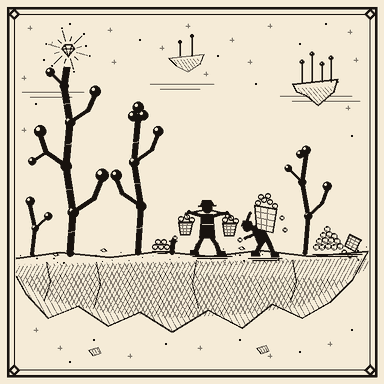

`chorus_fruit_bumper_harvest` · commodities · weight 5 · cooldown 2h · picture: `chorus_fruit_bumper_harvest.png`

**Impact:** trend, peak -25%, ramp 900s / hold 2700s / reversal ramp 2400s (noise ±3%)

**Markets:**

| Item | weightFactor | Direction |
|---|---|---|
| `minecraft:chorus_fruit` | 1.0 | ▼ |
| `minecraft:popped_chorus_fruit` | 0.7 | ▼ |

**EN:** The chorus plants of the outer End islands have grown wild this season, and returning delvers are hauling back more fruit than the markets can absorb. With popped chorus fruit piling up beside it in the warehouses, prices are drifting steadily lower.

Deutsch

**Äußere Inseln bringen eine Chorusfrucht-Schwemme**

Die Choruspflanzen der äußeren End-Inseln sind in dieser Saison wild gewuchert, und heimkehrende Delver bringen mehr Früchte zurück, als die Märkte aufnehmen können. Da sich geplatzte Chorusfrüchte daneben in den Lagern stapeln, geben die Preise stetig nach.

---

### Fire-resistance brewing drives magma-cream demand

`magma_cream_alchemy_demand` · commodities · weight 6 · cooldown 3h · picture: `magma_cream_alchemy_demand.png`

**Impact:** trend, peak +26%, ramp 750s / hold 2400s / reversal ramp 2700s (noise ±4%)

**Markets:**

| Item | weightFactor | Direction |
|---|---|---|
| `minecraft:magma_cream` | 1.0 | ▲ |

**EN:** With expeditions pushing ever deeper into the lava seas, brewers cannot mix fire-resistance potions fast enough. Magma cream is the key ingredient, and the alchemists' guild is buying every batch the slime-and-blaze hunters can render down.

Deutsch

**Feuerresistenz-Brauerei treibt die Magmacreme-Nachfrage**

Da Expeditionen immer tiefer in die Lavameere vordringen, kommen die Brauer mit dem Mischen von Feuerresistenz-Tränken nicht hinterher. Magmacreme ist die Schlüsselzutat, und die Alchemistengilde kauft jede Charge auf, die die Schleim- und Lohenjäger auslassen können.

---

### Rush to repair elytra empties membrane stocks

`phantom_membrane_repair_run` · commodities · weight 5 · cooldown 3h · picture: `phantom_membrane_repair_run.png`

**Impact:** trend, peak +30%, ramp 900s / hold 2100s / reversal ramp 2700s (noise ±4%)

**Markets:**

| Item | weightFactor | Direction |
|---|---|---|
| `minecraft:phantom_membrane` | 1.0 | ▲ |

**EN:** After a season of hard flying, every glider-pilot in the realm is scrambling to patch worn elytra - and only phantom membrane will do the job. Night-hunters cannot down the phantoms fast enough, and membrane prices are climbing with every torn wing.

Deutsch

**Ansturm auf Elytren-Reparaturen leert die Membranvorräte**

Nach einer Saison harten Fliegens versucht jeder Gleiter-Pilot des Reiches, abgenutzte Elytren zu flicken - und nur Phantommembranen taugen dafür. Die Nachtjäger können die Phantome nicht schnell genug erlegen, und die Membranpreise klettern mit jedem zerrissenen Flügel.

---

### Triumphant End expedition floods the market with relics!

`end_expedition_returns` · commodities · weight 2 · cooldown 24h · picture: `end_expedition_returns.png`

**Impact:** crash, peak -40%, ramp 300s / hold 1200s / reversal exponential 6000s (noise ±5%)

- fires at most once (notFired itself)
- records `frontier`=`end_breached`

**Markets:**

| Item | weightFactor | Direction |
|---|---|---|
| `minecraft:elytra` | 1.0 | ▼ |
| `minecraft:dragon_breath` | 0.6 | ▼ |

**EN:** A great expedition has returned from the End in triumph, its ships laden with elytra and vials of dragon's breath. The sudden flood of once-priceless relics has sent prices crashing as buyers realize the scarcity is broken - at least for now.

Deutsch

**Triumphale End-Expedition überschwemmt den Markt mit Relikten!**

Eine große Expedition ist im Triumph aus dem End zurückgekehrt, ihre Schiffe beladen mit Elytren und Fläschchen voll Drachenatem. Die plötzliche Schwemme einst unbezahlbarer Relikte hat die Preise abstürzen lassen, als den Käufern klar wurde, dass die Knappheit gebrochen ist - zumindest vorerst.

---

### Respawn anchors become the must-have - crying obsidian soars

`crying_obsidian_anchor_fad` · cultural · weight 5 · cooldown 3h · picture: `crying_obsidian_anchor_fad.png`

**Impact:** trend, peak +28%, ramp 900s / hold 2400s / reversal ramp 2700s (noise ±4%)

**Markets:**

| Item | weightFactor | Direction |
|---|---|---|
| `minecraft:crying_obsidian` | 1.0 | ▲ |
| `minecraft:*_bed` | -0.15 | ▼ |

**EN:** No frontier camp is complete without a respawn anchor this season, and the craze has sent crying obsidian to dizzy heights. With everyone abandoning their old beds for the glowing anchors, bed-makers are watching demand quietly slip away.

Deutsch

**Seelenanker werden zum Muss - Weinender Obsidian schießt hoch**

Kein Grenzlager gilt in dieser Saison als vollständig ohne Seelenanker, und die Mode hat Weinenden Obsidian in schwindelerregende Höhen getrieben. Da alle ihre alten Betten für die leuchtenden Anker aufgeben, sehen die Bettmacher zu, wie ihnen die Nachfrage stillschweigend entgleitet.

---

### Warlord posts a bounty on wither skulls!

`wither_skull_bounty` · conflict · weight 3 · cooldown 6h · **adminOnly** · picture: `wither_skull_bounty.png`

**Impact:** shock, peak +45%, hold 1800s / reversal exponential 4500s (noise ±6%)

**Markets:**

| Item | weightFactor | Direction |
|---|---|---|
| `minecraft:wither_skeleton_skull` | 1.0 | ▲ |
| `minecraft:soul_sand` | 0.4 | ▲ |

**EN:** A warlord massing for war has posted a lavish bounty on every wither-skeleton skull that can be brought to his fortress. Soul sand is being bought up alongside them to raise the beast itself, and both have shot up as mercenaries pour into the Nether fortresses.

Deutsch

**Kriegsherr setzt ein Kopfgeld auf Witherskelett-Schädel aus!**

Ein Kriegsherr, der zum Krieg rüstet, hat ein üppiges Kopfgeld auf jeden Witherskelett-Schädel ausgesetzt, der zu seiner Festung gebracht wird. Seelensand wird gleich mitgekauft, um die Bestie selbst zu beschwören, und beide sind in die Höhe geschossen, während Söldner in die Netherfestungen strömen.

---

## New events — Trade, politics, finance & culture

### The mint recoins the realm's currency!

`mint_recoinage_reform` · politics · weight 2 · cooldown 24h · picture: `mint_recoinage_reform.png`

**Impact:** trend, peak +28%, ramp 1500s / hold 3000s / reversal none (permanent)

- fires at most once (notFired itself)
- records `currency`=`reformed`

**Markets:**

| Item | weightFactor | Direction |
|---|---|---|
| `minecraft:gold_ingot` | 1.0 | ▲ |
| `minecraft:iron_ingot` | 0.6 | ▲ |

**EN:** By decree of the trade council the royal mint has begun recoining every coin in circulation to a heavier gold-and-iron standard. Every old piece must be melted and struck anew, and the mint's insatiable demand for metal is expected to keep prices structurally elevated for good.

Deutsch

**Die Münze prägt das Reichsgeld neu!**

Auf Erlass des Handelsrats hat die königliche Münze begonnen, jede umlaufende Münze auf einen schwereren Gold-und-Eisen-Standard umzuprägen. Jedes alte Stück muss eingeschmolzen und neu geschlagen werden, und der unstillbare Metallhunger der Münze dürfte die Preise dauerhaft strukturell erhöht halten.

---

### Dockworkers walk out - harbor cranes fall silent!

`dockworkers_strike` · labor · weight 6 · cooldown 3h · picture: `dockworkers_strike.png`

**Impact:** shock, peak +40%, hold 1800s / reversal exponential 3600s (noise ±5%)

**Markets:**

| Item | weightFactor | Direction |
|---|---|---|
| `minecraft:iron_ingot` | 1.0 | ▲ |
| `minecraft:copper_ingot` | 0.8 | ▲ |
| `#minecraft:planks` | 0.4 | ▲ |

**EN:** The dockworkers' guild has downed tools over withheld wages, and not a single crate now moves across the wharves. Metal and timber shipments are stranded on the quays, and merchants are already bidding up whatever iron, copper and planks remain inside the city walls.

Deutsch

**Hafenarbeiter legen die Arbeit nieder - die Krane stehen still!**

Die Zunft der Hafenarbeiter hat wegen einbehaltener Löhne die Arbeit niedergelegt, und keine einzige Kiste bewegt sich mehr über die Kais. Metall- und Holzlieferungen stranden an den Anlegern, und Händler treiben bereits die Preise für alles Eisen, Kupfer und Bauholz in die Höhe, das noch innerhalb der Stadtmauern liegt.

---

### Trade council embargoes all foreign metals!

`metals_export_embargo` · politics · weight 2 · cooldown 24h · picture: `metals_export_embargo.png`

**Impact:** trend, peak +24%, ramp 1200s / hold 2700s / reversal none (permanent)

**Markets:**

| Item | weightFactor | Direction |
|---|---|---|
| `minecraft:iron_ingot` | 1.0 | ▲ |
| `minecraft:copper_ingot` | 0.8 | ▲ |
| `minecraft:gold_ingot` | 0.6 | ▲ |

**EN:** In a bid to protect the home foundries the trade council has slammed an embargo on every foreign metal crossing the border. With cheap imports cut off, domestic iron, copper and gold lose their foreign competition - analysts expect home prices to settle permanently higher.

Deutsch

**Handelsrat verhängt Embargo auf alle ausländischen Metalle!**

Um die heimischen Gießereien zu schützen, hat der Handelsrat ein Embargo auf jedes ausländische Metall verhängt, das die Grenze überquert. Da die billigen Einfuhren wegfallen, verlieren heimisches Eisen, Kupfer und Gold ihre ausländische Konkurrenz - Analysten erwarten dauerhaft höhere Inlandspreise.

---

### Royal treasury floods the market with fresh coin

`treasury_stimulus_windfall` · economy · weight 6 · cooldown 4h · picture: `treasury_stimulus_windfall.png`

**Impact:** trend, peak +30%, ramp 900s / hold 2400s / reversal ramp 3000s (noise ±4%)

- announce delay: front-run window (30s–1m30s)

**Markets:**

| Item | weightFactor | Direction |
|---|---|---|
| `minecraft:diamond` | 1.0 | ▲ |
| `minecraft:gold_ingot` | 0.8 | ▲ |
| `minecraft:emerald` | 0.8 | ▲ |
| `minecraft:iron_ingot` | 0.6 | ▲ |

**EN:** The royal treasury has opened its vaults, pouring newly minted coin into the markets to spur trade after a long lean season. With coin suddenly cheap and plentiful, merchants are rushing into hard assets - gems and gold above all - to preserve their wealth before the money loses its shine.

Deutsch

**Königliche Schatzkammer überschwemmt den Markt mit frischem Geld**

Die königliche Schatzkammer hat ihre Gewölbe geöffnet und schüttet frisch geprägtes Geld in die Märkte, um den Handel nach einer langen mageren Zeit anzukurbeln. Da Münzen plötzlich billig und reichlich vorhanden sind, flüchten Händler in Sachwerte - vor allem Edelsteine und Gold -, um ihr Vermögen zu sichern, bevor das Geld seinen Glanz verliert.

---

### Counterfeit gold coin floods the market - trust collapses!

`counterfeit_coin_scandal` · crime · weight 3 · cooldown 6h · **adminOnly** · picture: `counterfeit_coin_scandal.png`

**Impact:** crash, peak -42%, hold 900s / reversal exponential 5000s (noise ±5%)

**Markets:**

| Item | weightFactor | Direction |
|---|---|---|
| `minecraft:gold_ingot` | 1.0 | ▼ |

**EN:** A smuggling ring has flooded the realm with expertly forged gold coin, and no one can tell true metal from lead-cored fakes. Assayers are refusing gold at the counter until every hoard is tested, and the panic to dump suspect coin has sent the gold market into free fall.

Deutsch

**Gefälschte Goldmünzen überschwemmen den Markt - das Vertrauen bricht ein!**

Ein Schmugglerring hat das Reich mit meisterhaft gefälschten Goldmünzen überschwemmt, und niemand kann echtes Metall von bleigefüllten Fälschungen unterscheiden. Prüfmeister verweigern Gold am Tresen, bis jeder Hort geprüft ist, und die Panik, verdächtige Münzen abzustoßen, hat den Goldmarkt in den freien Fall gestürzt.

---

### Daring vault heist empties the gem exchange!

`gemstone_heist` · crime · weight 4 · cooldown 4h · picture: `gemstone_heist.png`

**Impact:** shock, peak +40%, hold 1500s / reversal exponential 3600s (noise ±5%)

- announce delay: insider — price moves first (15s–45s before announcement)

**Markets:**

| Item | weightFactor | Direction |
|---|---|---|
| `minecraft:diamond` | 1.0 | ▲ |
| `minecraft:emerald` | 0.8 | ▲ |

**EN:** Thieves cracked the gem exchange's deepest vault overnight and made off with its entire diamond and emerald reserve. By the time the theft was announced, prices had already lurched upward - insiders, it seems, knew the stones were gone before the watch ever raised the alarm.

Deutsch

**Kühner Tresorraub leert die Edelsteinbörse!**

Diebe knackten über Nacht das tiefste Gewölbe der Edelsteinbörse und machten sich mit ihrer gesamten Diamant- und Smaragdreserve davon. Als der Diebstahl bekannt gegeben wurde, waren die Preise bereits nach oben gesprungen - Eingeweihte wussten offenbar vom Verschwinden der Steine, bevor die Wache überhaupt Alarm schlug.

---

### Court adopts royal purple - dye prices soar!

`royal_purple_fashion` · cultural · weight 5 · cooldown 3h · picture: `royal_purple_fashion.png`

**Impact:** trend, peak +30%, ramp 900s / hold 2400s / reversal ramp 2700s (noise ±4%)

**Markets:**

| Item | weightFactor | Direction |
|---|---|---|
| `minecraft:purple_dye` | 1.0 | ▲ |
| `minecraft:magenta_dye` | 0.7 | ▲ |
| `minecraft:pink_dye` | 0.5 | ▲ |

**EN:** The queen has declared royal purple the colour of the season, and every noble house is scrambling to re-dye its wardrobe before the next gala. Dyers cannot keep up with the orders, and prices for purple, magenta and pink dyes are climbing by the day as the fashion sweeps the court.

Deutsch

**Hof erhebt Königspurpur zur Mode - Farbpreise schnellen empor!**

Die Königin hat Königspurpur zur Farbe der Saison erklärt, und jedes Adelshaus wetteifert darum, seine Garderobe vor der nächsten Gala umzufärben. Die Färber kommen mit den Aufträgen nicht nach, und die Preise für Purpur-, Magenta- und Rosafarbstoffe steigen von Tag zu Tag, während die Mode über den Hof fegt.

---

### Council levies steep luxury tax on gems and gold

`luxury_goods_tax` · politics · weight 2 · cooldown 24h · picture: `luxury_goods_tax.png`

**Impact:** trend, peak -20%, ramp 1200s / hold 2700s / reversal none (permanent)

**Markets:**

| Item | weightFactor | Direction |
|---|---|---|
| `minecraft:diamond` | 1.0 | ▼ |
| `minecraft:emerald` | 0.8 | ▼ |
| `minecraft:gold_ingot` | 0.6 | ▼ |

**EN:** To fill the war chest the trade council has slapped a punishing luxury tax on every sale of diamonds, emeralds and gold. Buyers are balking at the new surcharge, demand for finery is cooling sharply, and analysts expect the chill on luxury prices to become a lasting fixture of the market.

Deutsch

**Rat erhebt saftige Luxussteuer auf Edelsteine und Gold**

Um die Kriegskasse zu füllen, hat der Handelsrat eine drückende Luxussteuer auf jeden Verkauf von Diamanten, Smaragden und Gold verhängt. Käufer schrecken vor dem neuen Aufschlag zurück, die Nachfrage nach Prunk kühlt merklich ab, und Analysten erwarten, dass die Preisdämpfung im Luxussegment zu einer dauerhaften Erscheinung am Markt wird.

---

### Speculative mania grips the trading floor!

`speculation_mania` · rumors · weight 4 · cooldown 4h · picture: `speculation_mania.png`

**Sequences:**

- **euphoria** (pick weight 2): buildup → +35% linear (600–1500s) ±5% · blowoff → hold (300–750s) ±8% · crash → -25% exponential (150–450s) ±6% · settle → 0% linear (1500s)
- **cooler_heads** (pick weight 1): rally → +18% linear (450–900s) ±4% · fade → 0% exponential (600–1200s)

- chains → `margin_call_crash` (on completion, 60% chance, delay 5m–15m)

**Markets:**

| Item | weightFactor | Direction |
|---|---|---|
| `minecraft:diamond` | 1.0 | ▲ |
| `minecraft:emerald` | 0.8 | ▲ |
| `minecraft:gold_ingot` | 0.6 | ▲ |

**EN:** A frenzy has seized the trading floor - clerks and courtiers alike are borrowing against their homes to pile into diamonds, emeralds and gold. Seasoned brokers mutter that manias like this always end the same way, but for now the only word on every tongue is 'buy'.

Deutsch

**Spekulationsrausch erfasst das Parkett!**

Ein Rausch hat das Parkett gepackt - Schreiber wie Höflinge beleihen ihre Häuser, um sich in Diamanten, Smaragde und Gold zu stürzen. Erfahrene Makler murmeln, dass solche Manien immer gleich enden, doch vorerst kennt jeder Mund nur ein Wort: 'kaufen'.

---

### Margin calls wipe out overleveraged traders in a cascade!

`margin_call_crash` · markets · weight 0 · cooldown 4h · picture: `margin_call_crash.png`

**Impact:** crash, peak -45%, hold 900s / reversal exponential 6000s (noise ±5%)

- requires `speculation_mania` fired ≥1m ago

**Markets:**

| Item | weightFactor | Direction |
|---|---|---|
| `minecraft:diamond` | 1.0 | ▼ |
| `minecraft:emerald` | 0.8 | ▼ |
| `minecraft:gold_ingot` | 0.6 | ▼ |

**EN:** The lenders have called in their loans all at once, and traders who bought the mania on borrowed coin cannot pay. Forced liquidations are feeding on themselves - every sale drives the price lower, triggering the next margin call - and diamonds, emeralds and gold are cascading downward with no floor in sight.

Deutsch

**Nachschussforderungen radieren überhebelte Händler in einer Kettenreaktion aus!**

Die Geldverleiher haben ihre Kredite alle auf einmal fällig gestellt, und Händler, die den Rausch auf Pump gekauft haben, können nicht zahlen. Zwangsverkäufe nähren sich selbst - jeder Verkauf drückt den Preis tiefer und löst die nächste Nachschussforderung aus -, und Diamanten, Smaragde und Gold stürzen kaskadenartig ins Bodenlose.

---
