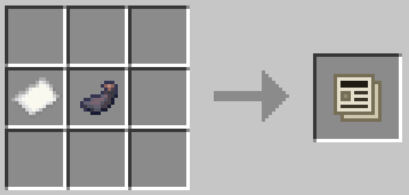
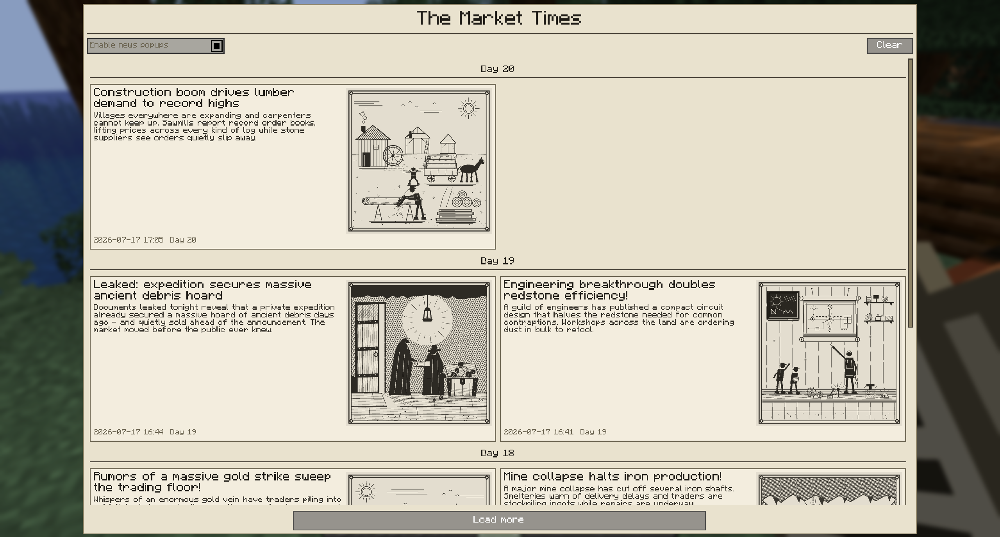
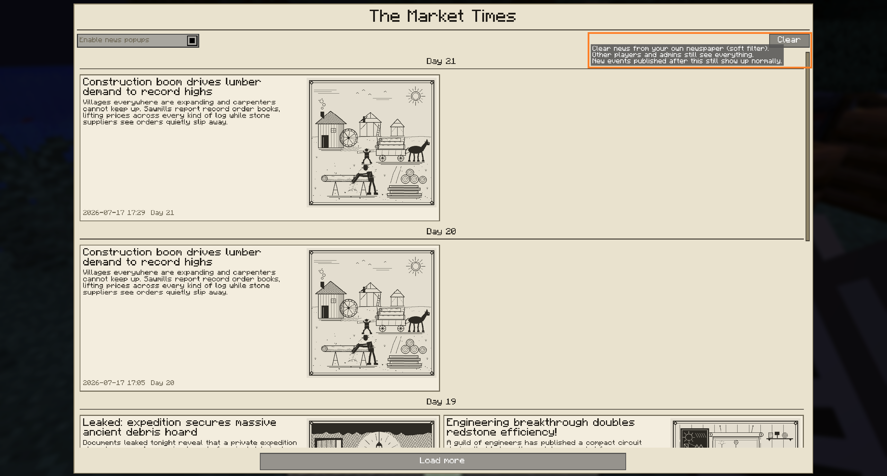
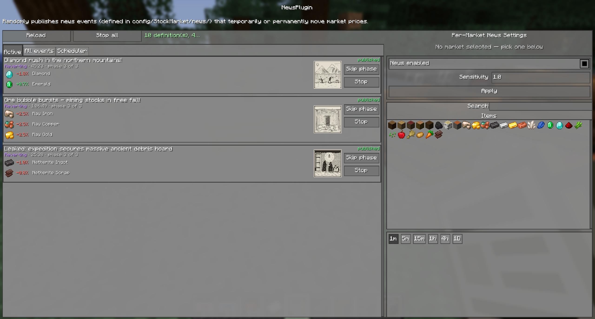
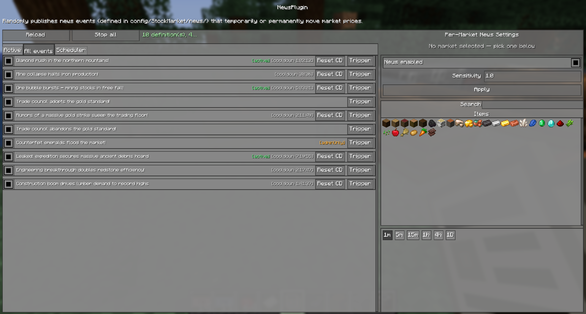
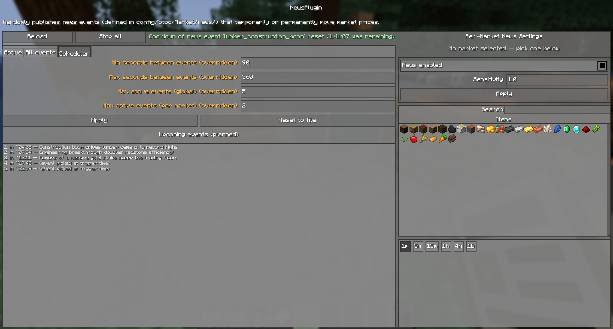
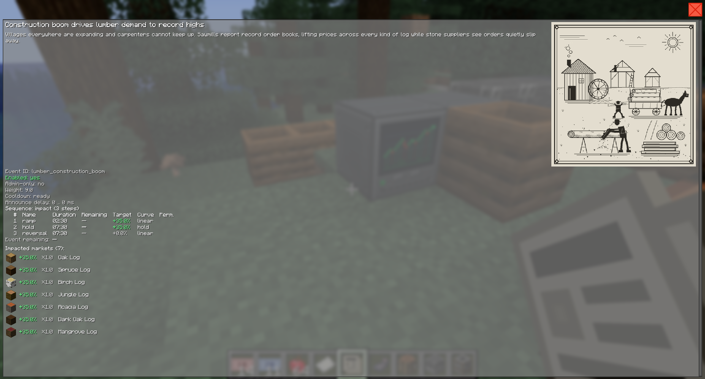

# News Event System Overview

## What Are News Events?

News events are headlines that move market prices. The server periodically publishes an event -- "Diamond rush in the northern mountains!", "Mine collapse halts iron production!" -- and the prices of the affected markets react: they ramp up or crash, hold for a while, and then return to normal (or, for some events, stay shifted permanently).

Every event is defined in a JSON file on the server, so admins control exactly which headlines exist, how strong their price impact is, and which markets they hit. The mod ships with a set of example events that is generated on first run. See [Configuring News Events](configuration.md) for the full JSON schema and the admin commands.

Players read the news in-game through a craftable **newspaper item**. Reacting to headlines before the market fully prices them in -- or getting caught by news that insiders already traded on -- is the gameplay loop this feature adds.

## For Players

### Getting the Newspaper

The newspaper (`stockmarket:newspaper`) is a **shapeless** crafting recipe -- drop the two ingredients anywhere in the crafting grid, in any order or

*Newspaper crafting recipe.*

Every crafting yields **one** newspaper. The item is reusable -- once you have it, you never need to craft another one.

**Other ways to open the news screen:**

- The **News** button on the [trading screen](../../../README.md#opening-the-trading-terminal).
- The **News** button on the [Management Screen](../../../README.md#opening-the-management-gui)'s overview tab (admins).
- The command `/stockmarket news` -- available to every player, no admin permission needed.
- For admins on creative servers: `/give @s stockmarket:newspaper`.

### The Newspaper Item

Right-click with the newspaper to open the news screen. It works from any hand, in any dimension, at any time -- no block or terminal is required.

### The News Screen

  
   
  <em>The newspaper feed -- headlines grouped by in-game day, newest first.</em>

The news screen is styled like a printed newspaper: a masthead at the top and a chronological feed of headlines below it, newest first. Each entry shows:

- The **headline** and the **article text**.
- The event's **picture**, if it defines one -- printed between headline and article in the newspaper's ink-on-paper grayscale look. Admins author them as plain PNG files, see [News Event Pictures](pictures.md).
- **Item icons** of the affected markets. If a market was deleted after the news was published, the entry still renders -- the icon falls back to a barrier icon with the stored item name.
- The **timestamp** (your local date and time) plus the in-game "Day N" the news was published on.
- A red **LIVE** badge while the event's price impact is still running. The badge compares the publish time against your local clock, so it is an approximation -- it tells you the story is still moving the market right now.

The feed loads the most recent news immediately and fetches older entries in pages of up to **100 entries** per request (the server-side page-size ceiling) -- click **Load more** at the bottom to go further back. How far back the history reaches is capped by the server (1000 entries by default).

### News Popups (Toast Opt-In)

By default, news is **pull only**: nothing pops up, nothing is printed to chat -- you discover news by opening the newspaper.

If you want to be notified, enable the **news popups checkbox** in the news screen. Opted-in players get a small vanilla-style toast (top right, no sound) with the headline whenever an event is published. The setting is stored per player on the server, survives relogs, and is **off by default**.

Opted-in players who join the server shortly after an event was published still get caught up: on join, the newest headlines from the last 10 minutes are shown as toasts (at most 3, oldest first). Players who did not opt in get nothing at all.

### Clearing Your Newspaper

  
   
  <em>The Clear button and its tooltip -- a soft, per-player filter.</em>

Opposite the popup checkbox, in the top-right corner of the newspaper's settings row, the **Clear** button removes every currently visible entry from **your own** newspaper. The clear is:

- **Soft and per-player** -- the underlying news records are never touched. Other players and admins still see everything as before.
- **Server-persisted** across relogs and restarts. The cutoff is stored on the master server as `newsClearedBeforeMs` in your player preferences.
- **Forward-safe** -- new events published after the clear appear in your feed normally. Only entries whose publish timestamp is at or before the moment you clicked Clear are hidden.

Pagination still walks past the hidden entries, so a `Load more` click after a clear correctly advances into older records that would have been visible if you had not cleared.

### Languages

Headlines and article texts come from the server's JSON files and can carry multiple translations inline. Your client picks the text in this order:

1. Your current Minecraft language (e.g. `de_de`),
2. English (`en_us`),
3. The first translation the event defines.

The resolution happens at render time, so switching the client language re-renders the whole news history in the new language immediately -- no relog needed.

## How News Moves Prices

News is driven by the **NewsPlugin**, a server plugin like the [three default plugins](../plugin-system/overview.md). It schedules events at random intervals, publishes the headline, and multiplies the target price of the affected markets while the event runs.

### The Impact Envelope

Every event follows the same three-phase curve:

1. **Ramp-up** -- the influence rises linearly from zero to its peak (`rampUpSeconds`).
2. **Hold** -- the influence stays at its peak (`durationSeconds`).
3. **Reversal** -- the influence returns to zero, either linearly (`ramp`), with an exponential decay (`exponential`), or **never** (`none`).

The peak strength is the event's `peakFactor`: `0.55` means +55% on the target price at the peak, `-0.4` means -40%. Because the impact is multiplicative, the same event works on a 2-coin dirt market and a 900-coin netherite market alike.

**Permanent events (`reversal: "none"`)** do not snap back: when the hold phase ends, the shift is baked into the market's default price and the event retires. The new price level is permanent and survives server restarts.

The envelope is the simple authoring form. Events can instead define **multi-step sequences** -- named steps with their own durations (rolled from ranges), curves, noise and even per-step market sets, so one event can play out a whole story like a pump-and-dump, and can carry several weighted story variants of which one is picked at activation. Events can also gate on the world's history via **trigger requirements** and a persistent **world-event registry**, and **chain** follow-up events into connected storylines. See [Advanced News Events](advanced-events.md).

### Interaction with the Other Plugins

News does not fight the existing price simulation -- it builds on it:

1. The **VolatilityPlugin** computes the base target price (random walk around the flow-driven equilibrium) as usual.
2. The **NewsPlugin** multiplies that target price by the combined factor of all active events on the market.
3. The **TargetPriceBot** sees the shifted target and places real orders to push the actual market price toward it.

So the visible price movement of a news event is produced by the bot actually trading -- with all the depth, slippage and momentum that implies. The news influence is applied in a separate stage after all plugins have computed their targets, so it works regardless of the plugin execution order.

### Which Markets Are Affected

An event never hits "the whole market". Each event defines market matchers (exact item ids, item tags, or wildcards -- see [markets\[\]](configuration.md#markets)), and the impact applies only to the intersection of:

- the markets the event's matchers resolve to, **and**
- the markets subscribed to the NewsPlugin, **and**
- the markets whose per-market **News enabled** setting is on.

An event whose matched markets are all unsubscribed (or news-disabled) can never fire. Each matched market gets its own `weightFactor`: `0.3` means it feels 30% of the impact, and a **negative** value inverts the direction -- one event can push diamonds down while pulling emeralds up.

### Per-Market Settings

Like every plugin, the NewsPlugin has per-market custom settings, editable in its management window:

| Setting | Default | Effect |
|---------|---------|--------|
| News enabled | on | When off, the market is excluded from news entirely: it never counts toward event eligibility and active events stop affecting it. |
| Sensitivity | `1.0` | Scales the news impact for this market. `0.5` halves every event's effect, `2.0` doubles it. Also scales the permanent shift of `reversal: "none"` events. |

### Safety Limits

- The combined factor of all events on one market is clamped to **[0.1, 10]** -- stacked crashes can never floor a market to zero, stacked rallies can never overflow it.
- The scheduler caps how many events run at once, globally and per market (configurable, defaults: 3 global / 1 per market).
- Events run on **pause-safe time**: their progress accumulates only while the server is actually ticking. An event does not silently expire while the server is paused, empty, or stopped, and disabling the plugin freezes all timers and influence.

## The News Plugin Management Window

Admins manage the plugin through the [Plugin Management Screen](../plugin-system/management.md): the NewsPlugin entry has an **Open Plugin** button that opens its dedicated window. The window has three tabs across the top -- **Active**, **All events** and **Scheduler** -- above the global **Reload** and **Stop all** buttons and a status line. The right side of the window holds the per-market **News enabled** / **Sensitivity** editor and the price chart of the currently selected market.

### Active tab

  
   
  <em>The Active tab -- one row per currently running event.</em>

The Active tab lists every currently running event with its phase (pending / ramping / holding / reverting / permanent -- or, for [sequence events](advanced-events.md#multi-step-sequences), the current step name with "phase i of n" and a countdown to the next step), the remaining time, and whether the headline is already published. Each row shows the **impacted markets** (item icons + names) and the current price factor per market (e.g. `+25%`); clicking a market icon selects it in the right-side editor. At the right edge of every row a **Skip phase** button fast-forwards the event into its next phase or [sequence step](advanced-events.md#multi-step-sequences) (skipping the last phase ends the event normally), and a **Stop** button hard-stops it in any phase -- the price influence is removed and the full cooldown restarts (same as `/stockmarket news skipphase` and `/stockmarket news stop`). Clicking anywhere else on the row opens the [event details screen](#event-details-screen).

### All events tab

  
   
  <em>The All events tab -- every loaded event definition with per-event admin controls.</em>

The All events tab lists **every loaded event definition** (server-confirmed, refreshed on every admin response) with the state markers `[adminOnly]`, `[active]`, `[disabled]` and `[cooldown <remaining>]` next to the locale-resolved headline. Each row has an **Enable / Disable checkbox** on the left (server-authoritative -- the visual state reverts to the confirmed value on click and only flips when the response snapshot arrives), a right-aligned **Trigger** button that fires the event on all its matched markets, and a **Reset CD** button that appears next to Trigger while the event is still on cooldown. Triggering an event whose cooldown is still running or whose [trigger requirements](advanced-events.md#trigger-requirements) are unmet opens a confirmation dialog first, listing the unmet requirements. Clicking anywhere else on the row opens the [event details screen](#event-details-screen).

### Scheduler tab

  
   
  <em>The Scheduler tab -- live scheduler override editor and the upcoming events timeline.</em>

The Scheduler tab exposes the four **effective** scheduler values as editable numeric fields: **Min seconds between events**, **Max seconds between events**, **Max active events (global)** and **Max active events (per market)**. Values that differ from the JSON config are marked `(overridden)`. The stream refreshes each field every 500 ms, but a box that the admin has edited is left alone until Apply resolves it. **Apply** sends only the actually edited values (validated and confirmed server-side); **Reset to file** clears every override so the JSON scheduler block applies again. Below the fields, the **Upcoming events** timeline lists the pre-planned scheduler slots (each is re-validated when it fires and may be skipped or replaced); planned entries are clickable and open the event's details screen, while time-only slots state that the event is picked at trigger time.

### Event details screen

  
   
  <em>The event details screen -- opened by clicking a row in either the Active or the All events tab.</em>

Clicking a row in the Active or the All events tab (or a planned entry in the Scheduler tab's upcoming timeline) opens a dedicated details screen with the full snapshot of the definition:

- The locale-resolved **headline** and **article text**.
- The **event picture** in the top-right corner (hidden when the event has no picture; see [News Event Pictures](pictures.md)).
- The **definition parameters**: `enabled`, `adminOnly`, `weight`, remaining cooldown, and the announce-delay range.
- The **per-sequence step table** with columns for step number, name, duration, remaining countdown (live-highlighted for the running step), target factor, curve, and a permanent-shift marker.
- One row per **impacted market** with the item icon, the signed peak percentage and the matcher weight factor.
- The **trigger requirements** list (with per-line met / unmet markers) and the **chained events** list, when the event defines any.

ESC returns to the plugin management window with its full state (selected tab, scroll position, market selection) intact.

## Master/Slave Servers

In a multi-server setup, news runs entirely on the **master** server: the master schedules events, moves the prices and stores the history. Published headlines are relayed to all slave servers and their players automatically, the news screen's history requests are routed to the master transparently, and the admin commands work from slave servers too (tab completion of event ids is only available on the master). Newspaper [pictures](pictures.md) are fetched the same way: clients request them in small hash batches that slaves pass through to the master, which serves them from the published-picture store with a per-player rate limit (a large history catches up in the background over a few minutes). On the client, fetched pictures live in an in-memory per-session cache (visible entries load first, the rest prefetches in the background) and are automatically converted to the newspaper's ink-on-paper grayscale look.

## Persistence

Everything survives a server restart:

- **Active events** resume exactly where they were -- including events waiting in an announce-delay window. Running events keep the impact values they started with, even if the definitions were edited or removed in the meantime.
- **Cooldowns and the scheduler timer** continue from their remaining time.
- The **news history** is saved with the world data under `world/data/StockMarket/News/history/` as 100-record chunk files (`NNN.nbt` + `NNN.hashes.nbt` sidecars), capped at `historyMaxEntries` (default 1000). Existing worlds are migrated from the pre-v2.0.4 single `history.nbt` file automatically on first launch. See [History Persistence and Chunk Layout](configuration.md#history-persistence-and-chunk-layout).
- **Published newspaper [pictures](pictures.md)** are snapshotted into `world/data/StockMarket/News/pictures/` at publish time, so history entries keep their original picture even after the config picture is swapped or deleted; pictures of pruned history entries are cleaned up automatically.
- The **world-event registry** (`world/data/StockMarket/News/registry.nbt`) remembers which events have fired (count, first/last real-world time, in-game day) plus custom key/value records written by events -- its timestamps use real wall-clock time, so they keep aging while the server is offline (unlike cooldowns). See [Advanced News Events](advanced-events.md#the-world-event-registry).
- **Pending [chain](advanced-events.md#event-chains) firings** (scheduled follow-up events) survive restarts too; their delays tick on the same pause-safe time as cooldowns.
- Permanent (`reversal: "none"`) shifts are baked into the market's default price exactly once -- a restart never re-applies them.

A fresh world starts with the NewsPlugin registered and enabled. Worlds created before the news system existed get the plugin auto-created once (enabled and subscribed to all existing markets); if an admin deliberately deletes it, it is not re-created.
